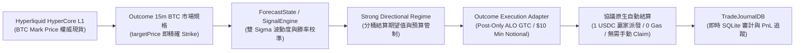
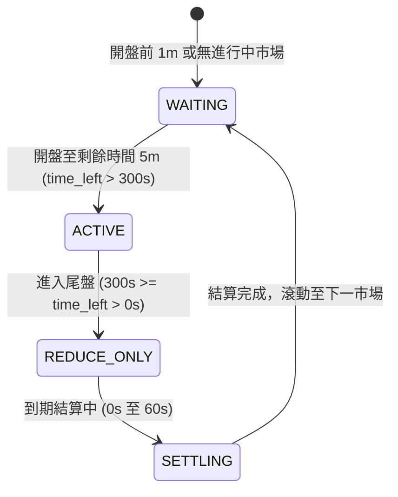
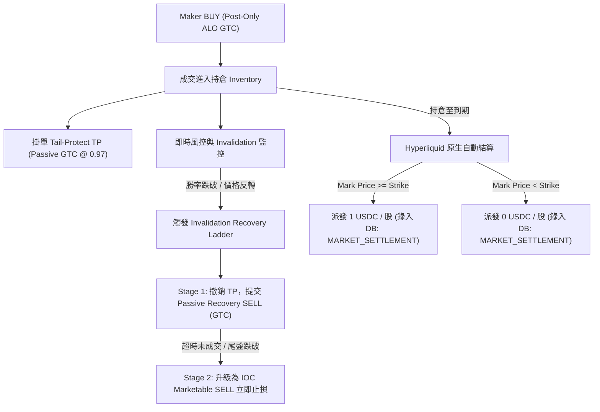

# Hyperliquid Outcome (HIP-4) BTC 15-Minute Prediction Market Trading Bot — Current Authority

> **權威架構版本 (Authority Version)**：2.0.0 (Hyperliquid Outcome HIP-4 Native)  
> **建立與審計日期**：2026-08-23  
> **目標系統**：Hyperliquid HyperCore L1 原生預測市場 — Outcome (HIP-4 協議標準)  
> **單一權威聲明**：本文件取代原 `project_overview.md`，為系統唯一的設計、架構、量化模型與執行權威規範。

---

## 壹、 系統總覽與架構優勢 (System Overview & Architectural Advantages)

本交易系統專為 **Hyperliquid 原生預測市場平台 —— Outcome (HIP-4 協議)** 所設計，專注於 15 分鐘週期的 BTC 數字預測市場做市與方向性套利。

系統採用非同步低延遲 Python 原生架構，透過 Hyperliquid L1 的 MessagePack + keccak256 + EIP-712 雙層 Agent Key 授權機制進行無感毫秒級下單與撤單。

### 核心技術優勢



1. **L1 原生撮合與極低延遲**：撮合延遲 `< 200ms`，消除中心化 API 尖峰排隊與丟單風險。
2. **免除 Oracle 錯位風險**：`OutcomeMarketSpec` 直接標明 `targetPrice` 為 Strike，結算採用 HyperCore BTC Mark Price 線性插值，徹底告別外部 TWAP 爬蟲。
3. **全網統一保證金 (Unified Margin)**：USDC 在現貨、永續合約與預測市場通用，零 Gas 損耗。
4. **協議原生自動結算**：市場到期自動派發 1 USDC，掛單自動取消，完全無需外部合約 Redeem / Claim 腳本。
5. **安全暫態 Agent Key**：主錢包（EOA）簽名一次授權，Agent Key 記憶體中運行，零私鑰洩漏風險。

---

## 貳、 端到端交易生命週期 (End-to-End Trading Lifecycle)

### 1. 生命週期狀態機 (Market Lifecycle State Machine)



| 階段 | 狀態代碼 | 行為與管制規則 | 觸發條件 |
| :--- | :--- | :--- | :--- |
| **等待發現** | `WAITING` | 監聽 `outcomeMeta`，自動解析即將開盤的 15m BTC 市場與 Strike。 | 距離開盤 $> 0\text{s}$ 或無活躍市場 |
| **做市活躍** | `ACTIVE` | 計算 `ForecastState`、`side_score`，提交 Maker Post-Only (ALO) BUY 掛單。 | 開盤至剩餘時間 $> 300\text{s}$ |
| **僅允許減倉** | `REDUCE_ONLY` | 嚴格禁止新開倉 BUY，僅保留 TP 或觸發 Invalidation 止損階梯。 | 剩餘時間 $\le 300\text{s}$ |
| **協議結算** | `SETTLING` | 撤銷所有殘留掛單，監聽 L1 USDC 派發並記錄 `MARKET_SETTLEMENT`。 | 剩餘時間 $\le 0\text{s}$ |

### 2. BTC 預測市場規範解析 (Market Spec Parsing)

Outcome 支援多週期 BTC 預測市場規格格式：
- **15 分鐘合約**：`class:priceBinary|underlying:BTC|expiry:YYYYMMDD-HHMM|targetPrice:78213.5|period:15m`
- **日線合約 (Daily)**：`class:priceBinary|underlying:BTC|expiry:YYYYMMDD-HHMM|targetPrice:77431|period:1d`
- **Outcome ID**：例如 `1145` (Daily) 或 `516` (15m)
- **Side 0 (`#11450`)**：YES / UP，結算 Mark Price $\ge 77431$ 派發 1 USDC。
- **Side 1 (`#11451`)**：NO / DOWN，結算 Mark Price $< 77431$ 派發 1 USDC。
- **Wire Asset ID**：
  $$\text{Asset ID} = 100\,000\,000 + (\text{outcomeId} \times 10) + \text{sideIndex}$$

---

## 參、 核心量化模型與決策引擎 (Quantitative Brain)

### 1. 統一波動度與公允定價模型 (`ForecastState` & `SpotPricer`)
- **輸入**：HyperCore BTC Mark Price、合約 Strike (`targetPrice`)、剩餘時間 $\tau$、盤口微觀 mid。
- **波動度估計**：
  - 歷史滾動收益率標準差 $\sigma_{\text{hist}}$
  - 時間衰減修正：$\sigma_{\text{decay}} = \sigma \cdot \sqrt{\tau / \tau_{\text{ref}}}$
  - 隱含波動度下限保護 (Implied Volatility Floor)
- **公允勝率**：
  $$d_2 = \frac{\ln(S / K) - \frac{1}{2}\sigma^2 \tau}{\sigma \sqrt{\tau}}, \quad P(\text{UP}) = \Phi(d_2)$$

### 2. 方向性決策評分與分桶勝率校準 (`SignalEngine` & `StrongDirectionalRegime`)
- **`side_score` 計算**：結合價格偏離 Strike 之點數、盤口深度不平衡、動量因子與勝率預測。
  - `side_score > +0.20` $\rightarrow$ 判定方向為 **UP**
  - `side_score < -0.20` $\rightarrow$ 判定方向為 **DOWN**
  - 否則為 **NONE**（放棄開倉，嚴禁摸魚無效交易）。
- **進場窗口與預算管制**：
  - 開盤前 10–30 秒與 30–60 秒分桶結算期望值（Resolution EV）校準。
  - **單一市場一次性進場保證**：首筆成交即鎖定該市場預算，嚴格禁止追價加倉（Hard limited to 1 BUY per market cycle）。

### 3. 下單規模與 10 USDC 最小名義價值校準 (`QuoteEconomics`)
- **Min Notional 限制**：Hyperliquid 協議要求開倉名義價值 $\text{price} \times \text{shares} \ge 10\text{ USDC}$。
- **動態股數計算**：
  $$\text{shares} = \max\left(\text{target\_shares}, \left\lceil \frac{10.0}{\text{price}} \right\rceil\right)$$
- **費率模型**：
  - Maker 基準費率：1.5 bps (0.015%)，疊加 4% 推薦碼折扣後為 1.44 bps。
  - 預期淨收益門檻：$\text{robust\_net} \ge 0.001\text{ USDC}$。

---

## 肆、 執行與止損階梯架構 (`OutcomeExecutionAdapter`)



1. **Maker BUY 下單**：
   - 提交 GTC Post-Only (`tif="Alo"`)，確保 100% 享受 Maker 費率且不穿越盤口。
   - 報價重掛機制（Requote Hysteresis）：若價格變動小於門檻跳數，維持原單佇列優先權（Queue Priority）。
2. **獲利止盈 (Take-Profit)**：
   - 預設掛於 `0.97` GTC 限價賣單，直至到期或觸發出場。
3. **失效止損階梯 (Invalidation Recovery Ladder)**：
   - **階段一（被動掛單）**：即時撤銷 TP，提交 `RECOVERY_EXIT_PASSIVE_TTL_SEC` 之 GTC 被動限價賣單。
   - **階段二（主動市價）**：若超時或在尾盤急跌，立即發送 `IOC` (Immediate-Or-Cancel) 賣單全數離場。

---

## 伍、 模組目錄架構與檔案權責 (Codebase Directory Map)

```text
/Users/cheng-kaihuang/Hyperliquid_prediction_bot/
├── bot/
│   ├── adapters/
│   │   ├── outcome_auth.py        # Agent Key 生成、MessagePack、EIP-712 簽名與 Asset ID 計算
│   │   └── outcome_client.py      # 原生 Python 非同步/同步 REST (/info, /exchange) 與 WebSocket 串流
│   ├── lifecycle/
│   │   ├── outcome_lifecycle.py   # class:priceBinary 規格解析、15m 市場發現與狀態流轉
│   │   └── legacy.py              # 兼容輔助函式
│   ├── pricing/
│   │   └── outcome_pricing.py     # HyperCore BTC Mark Price、L2 盤口追蹤與 10 USDC 經濟學門檻
│   ├── execution/
│   │   └── outcome_execution.py   # Maker BUY (ALO)、TP 掛單、IOC 止損階梯與到期結算核算
│   ├── signal_engine.py           # 核心機率偏離評估與 side_score 計算
│   ├── forecast_state.py          # Sigma 波動度、時間衰減與 Delta 計算
│   ├── strong_directional_regime.py # 勝率校準分桶與 Resolution EV 機制
│   ├── position_manager.py        # 單市場 1 筆預算管制與倉位鎖定
│   ├── app_config.py              # 統一組態配置 (含 HyperliquidConfig)
│   ├── launcher.py                # 啟動器、預檢 (Preflight) 與多環境管理
│   └── enums.py                   # MarketPhase, ActiveSide 等枚舉
├── monitoring/
│   ├── trade_journal_db.py        # SQLite 本地交易日誌與事件審計
│   └── pnl_attribution.py         # PnL 多維度歸因分析
├── execution/
│   ├── maker_engine.py            # 做市報價計劃生成
│   └── rebate_model.py            # 費率與 QuoteEconomics 結構
├── config/
│   ├── operator.env.example       # 支援的維運人員設定檔範本
│   └── profiles/
│       └── btc15_twap_v3.env      # 基準策略參數配置
├── tests/                         # 310+ 完整單元與回歸測試套件
├── .env.example                   # 本地環境變數範例 (含 HL_* 密鑰)
├── README.md                      # 英文官方操作文檔
├── docs/
│   └── readme_ZH.md               # 繁體中文官方操作文檔
└── run_bot.py                     # 主策略執行入口
```

---

## 陸、 環境變數與維運配置指引 (Environment & Operator Configuration)

### 關鍵環境變數清單

| 變數名稱 | 預設值 / 格式 | 說明 |
| :--- | :--- | :--- |
| `VENUE` | `hyperliquid` | 目標預測市場（`hyperliquid` 或 `polymarket`） |
| `HL_WALLET_ADDRESS` | `0x...` | 主帳戶錢包地址 (EOA) |
| `HL_PRIVATE_KEY` | `0x...` (64 hex) | 主帳戶私鑰 (用於一次性簽名授權 Agent Key) |
| `HL_AGENT_PRIVATE_KEY` | `0x...` (選填) | 專用 Agent Key 私鑰 (若留空則程式自動生成暫態 Key) |
| `HL_TESTNET` | `0` (主網) / `1` (測試網) | 是否連線至 Hyperliquid Testnet |
| `HL_MIN_NOTIONAL_USDC` | `10.0` | 最小開倉名義價值 (USDC) |
| `HL_REFERRAL_CODE` | `""` | 推薦碼 (享受 4% 手續費返還折扣) |
| `ENTRY_SCORE_MIN` | `0.20` | 強方向性進場最低分數門檻 |
| `FIRST_ENTRY_SCORE_MIN` | `0.22` | 首筆進場嚴格分數門檻 |
| `FIRST_ENTRY_MAX_TIME_LEFT_SEC` | `720` | 開盤後允許首筆進場的最大剩餘時間 (秒) |
| `HOLD_TO_REDEEM` | `1` | 獲利時鎖定至到期結算 (1 USDC 派發) |
| `RECOVERY_EXIT_ENABLED` | `1` | 啟用 Invalidation 階梯止損 |

---

## 柒、 快速啟動與日常維運命令 (Operational Runbook)

### 1. 執行安全性預檢 (Preflight Check)
```bash
.venv/bin/python bot/launcher.py --preflight-only
```

### 2. 啟動模擬回測 / 影子交易 (Dry-run Simulation)
```bash
.venv/bin/python bot/launcher.py --venue hyperliquid
```

### 3. 啟動實盤交易 (Live Trading)
```bash
.venv/bin/python bot/launcher.py --venue hyperliquid --live
```

### 4. 運行完整回歸測試套件 (Automated Test Suite)
```bash
.venv/bin/pytest
```

---

> **架構維護承諾**：本專案嚴格維持單一權威文件原則。所有量化邏輯調整、費率變更或執行策略更新，必須同步修訂本文件與對應單元測試。
