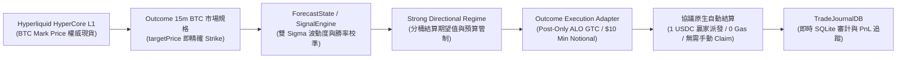
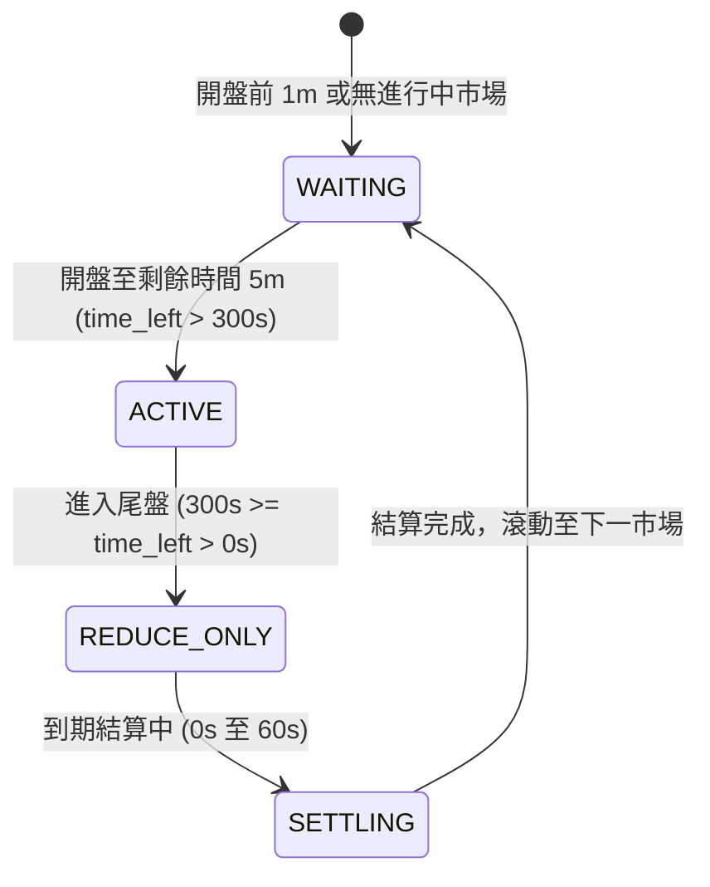
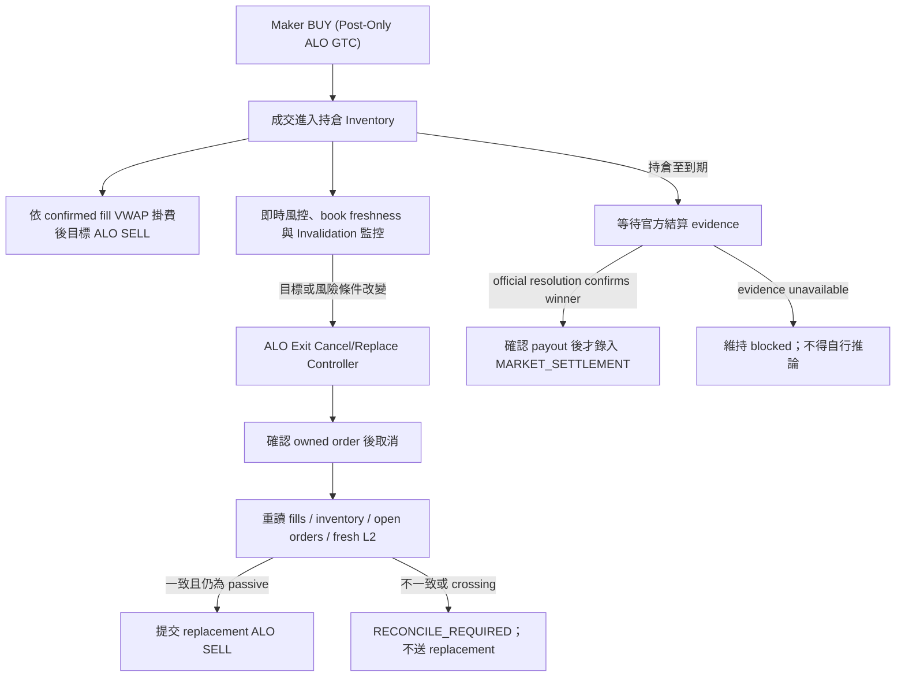

# Hyperliquid Outcome (HIP-4) BTC 15-Minute Prediction Market Trading Bot — Current Authority

> **權威架構版本 (Authority Version)**：2.1.1 (Hyperliquid Outcome HIP-4 Liquidity-Aware Scaling Baseline)
> **建立與審計日期**：2026-08-23；最近修訂：2026-08-28
> **目標系統**：Hyperliquid HyperCore L1 原生預測市場 — Outcome (HIP-4 協議標準)  
> **單一權威聲明**：本文件取代原 `project_overview.md`，為系統唯一的設計、架構、量化模型與執行權威規範。

> **遷移保護原則（2026-08-23 補充）**：原 Polymarket 程式中的訊號、波動度、公允價格、進出場、風控、日誌、報表與測試，均是本專案的量化知識資產與回歸基準，必須保留並逐項移植。只有已被 Outcome 等價機制取代、且有對照測試證明不再需要的 *venue adapter 邊界*，才可停止使用；不得以檔名含 Polymarket、Nautilus、Polygon 或 Redeem 作為刪除理由。

> **實盤狀態**：已驗證主網 `outcomeMeta`、`allMids` 與 BTC YES L2 book 可唯讀連線；尚未完成 agent-key 下單、成交/持倉事件與結算的端到端驗證。因此本文件的目標架構不等於已完成實作，live 解鎖前必須依「陸、五階段遷移實施路徑」逐項驗收。

---

## 零、遷移執行追蹤（Migration Execution Tracker）

| 能力 | 可重用的既有知識資產 | Outcome 替換邊界 | 狀態 |
| :--- | :--- | :--- | :--- |
| 市場資料 | ForecastState、SpotPricer、SignalEngine | OutcomeClient、OutcomeLifecycle、OutcomePricingState、Outcome snapshot bridge、OutcomeShadowRunner | **已開始**：將 BTC mark 與 L2 book 映射為既有 MarketSnapshot；唯讀 shadow runtime 已可寫入 journal |
| 下單與撤單 | quote economics、re-quote、單市場限額 | OutcomeExecutionAdapter | mock 測試存在；尚待 SDK/testnet 對照 |
| 成交與持倉 | PositionManager、fill ledger、exit engine | OutcomeFillEvent / OutcomeJournalBridge / OutcomeAccountSynchronizer | **已開始**：`spotClearinghouseState` 的 `+<encoding>` balance、`frontendOpenOrders`、`userFills` 唯讀映射為既有 PositionState 與 journal schema |
| 結算與 hold-to-redeem | TradeJournalDB、regime calibration、PnL attribution | OutcomeSettlementEvent | **已開始**：只接受官方確認的結算事件，禁止用即時 BTC mid 推定 |
| 風控與研究 | entry gate、invalidation ladder、shadow reports | Outcome market key / inventory source | 待上述事件與持倉同步完成後接線 |

已完成的轉譯層包括 `bot/outcome_event_bridge.py`、`bot/outcome_snapshot_bridge.py` 與 `bot/outcome_account_sync.py`。它們刻意不修改既有 Polymarket 策略核心，並以相同的 SQLite `ORDER_FILLED` / `MARKET_SETTLEMENT` schema 餵給既有分析與 calibration。帳戶同步只呼叫 `/info` 的唯讀端點：`spotClearinghouseState`、`frontendOpenOrders`、`userFills`；`entryNtl / total` 僅作為聚合平均成本，`hold` 會從可賣庫存扣除。任何 `dir=settlement` fill 僅留作待驗證證據，不能生成 `MARKET_SETTLEMENT` 或解鎖下一市場。對照測試位於 `tests/test_outcome_event_bridge.py`、`tests/test_outcome_snapshot_bridge.py`、`tests/test_outcome_account_sync.py`。

### Polymarket → Outcome 移植覆蓋表（2026-08-24 實碼審計）

**審計範圍與判讀規則。** 本表逐一比較 `/Users/cheng-kaihuang/Polymarket-BTC-15-Minute-Trading-Bot-main` 與本 repo 的 Python 原始碼、Outcome runtime import path、及測試檔案；不是依檔名猜測。兩 repo 沒有 runtime import 關係：Outcome repo 是保有共同程式的獨立副本，日後原 repo 的新修改不會自動同步。狀態含義如下：

- **已移植**：Outcome adapter 已接入正式或 shadow path，且有 Outcome 對照測試。
- **部分移植**：共同核心仍完整保留，但只在 shadow / 研究使用，或實盤尚未以該核心決策。
- **保留規格**：原始碼與測試完整留存，作為行為規格；尚未有 Outcome 接線。
- **不適用／刻意不移植**：此程式直接依賴 Polymarket CLOB、Gamma、Chainlink、Polygon CTF 等語意；替代機制另列，不能直接沿用。

| Polymarket 核心模組／知識 | Outcome 對應層與目前實際接線 | 覆蓋測試 | 狀態與未移植原因 |
| :--- | :--- | :--- | :--- |
| 共用領域模型：`bot/models.py`、`enums.py`、`market_cycle_state.py` | `OutcomeMarketSpec`、`build_outcome_market_snapshot()`、`build_outcome_position_state()` 將 coin、週期、L2、庫存映射為相同 `MarketSnapshot` / `PositionState`。 | `test_outcome_lifecycle.py`、`test_outcome_snapshot_bridge.py`、`test_outcome_account_sync.py` | **已移植**。原共同模型未改寫。 |
| Forecast、公允價格、訊號：`forecast_state.py`、`signal_engine.py`、`side_decision.py` | `OutcomeShadowRunner` 實際建立 `ForecastState`、`SignalEngine`，以 HyperCore BTC mark、Outcome strike 與 YES/NO L2 寫 telemetry。 | 原 `test_forecast_state.py`、`test_signal_engine_missing_data.py`（原檔完整保留）；`test_outcome_shadow_runner.py` | **部分移植**。shadow 已用；正式 `bot/launcher.py` 的 live entry 目前仍是簡化 `spot-strike` score，**未**呼叫上述完整核心，故不得視為自動策略已移植。`side_decision.py` 的 Polymarket Chainlink history 仍不可作 Outcome live input。 |
| Entry edge 與確認：`entry_decision.py`、`entry_quality.py`、`edge_state.py`、`entry_confirmation.py`、`strong_directional_regime.py` | 目前只保留模組／設定／回歸規格；Outcome shadow 僅輸出訊號 telemetry，沒有將它們的 entry decision 送入 official live runtime。 | 原 `test_entry_decision.py`、`test_entry_confirmation.py`、`test_edge_state.py`、`test_strong_directional_regime.py`（完整保留） | **保留規格**。必須先以 P2/P3 的 period-specific evidence 校準，才可建立 Outcome feature adapter；不能把 Polymarket 15m 門檻直接套到 Outcome 1d 或未來 15m。 |
| Quote economics／報價計畫：`quoting.py`、`quote_service.py`、`quote_runtime.py`、`execution/maker_engine.py`、`execution/rebate_model.py` | `OutcomePricingState` 重用 `QuoteEconomics`；`OutcomeMakerStateMachine` / official SDK gateway 可 ALO buy、fill 後 ALO sell、取消與 restart recovery。 | 原 `test_quote_plan.py`、`test_quoting.py`、`test_execution_penalty_calibration.py`；`test_outcome_pricing.py`、`test_outcome_maker_state_machine.py`、`test_outcome_execution_gateway.py` | **部分移植**。基本 maker lifecycle 已實測；原 QuoteService 的 fair-edge、re-quote、queue/cancel economics 尚未接入 Outcome live path，且 Polymarket rebate/fee schedule 不可沿用。 |
| 倉位與 exit：`position_manager.py`、`exit_engine.py`、`execution/exit_policy.py` | account bridge 將真實 balances 餵入未修改的 `PositionManager`；shadow 以未修改的 `ExitPolicyEngine` 產生 exit decisions。 | 原 `test_adaptive_min_hold.py`、`test_adaptive_trailing.py`、`test_exit_audit.py`；`test_outcome_account_sync.py`、`test_outcome_shadow_runner.py` | **部分移植**。正式 live runtime 現在只管理「ALO buy → inventory → ALO take-profit sell」；尚未把 `ExitPolicyEngine` 的完整決策轉為 Outcome cancel/replace/reduce-only 操作。 |
| Recovery／止損階梯：`recovery_exit_ladder.py`、`taker_exit.py`、`risk_policy.py` | `OutcomeAccountRecovery`、`OutcomeMakerStateMachine` 與 `OutcomePreTradeRiskGate` 實作 restart reconciliation、未知曝險 fail-closed、owned buy cancel；P1 stream health 阻擋新 entry。 | 原 `test_recovery_exit_ladder.py`、`test_risk_policy_recovery.py`、`test_f2_trailing_profit_release.py`、`test_f3_catastrophic_sl_gate.py`、`test_f4_last_resort_guard.py`；`test_outcome_account_recovery.py`、`test_outcome_risk_gate.py`、`test_outcome_stream_health.py` | **部分移植**。帳戶／資料故障防線已對應；原 P5 recovery ladder 的 passive→IOC/taker exit 不可自動沿用，因 Outcome live policy 目前只准 post-only，且尚無費後 recovery fill evidence。 |
| Hold-to-redeem／結算 PnL：`exit_engine.py`、`post_trade.py`、`merge_ops.py`、redeem scripts | shadow 可產生原 `HOLD_TO_REDEEM` 決策；`OutcomeSettlementAdapter` 只接受 SDK `fetchSettledOutcome`，sidecar 的 `merge_outcome` 僅限成對 YES+NO conversion 且另有 gate。 | 原 `test_hold_to_redeem_reversal.py`、`test_adversarial_real_pnl.py`；`test_outcome_settlement.py`、`test_outcome_spec_audit.py` | **部分移植／結算 blocker**。Outcome 無已證實的 generic one-sided redeem API，故不能把 Polymarket redeem/allowance code 直接移植；必須等 official settlement 與帳戶 payout evidence，才可正式入帳。 |
| 市場發現與週期 rollover：`market_discovery.py`、`market_data.py`、`lifecycle.py` | `lifecycle/outcome_lifecycle.py` 解析 `outcomeMeta`、expiry、target、side metadata，並以 `OUTCOME_MARKET_PERIODS` / fallback 選擇 15m、1d 等實際存在市場。 | 原 `test_runtime_env.py`；`test_outcome_lifecycle.py`、`test_outcome_market_selection.py`、`test_outcome_market_metadata.py` | **已移植**。Gamma slug／CLOB instrument discovery 為 **不適用**；現時無 15m 時安全 fallback 到 1d，strict 15m 時等待而不錯選。 |
| 行情與 book freshness：`spot_pricer.py`、`price_streams.py`、`market_runtime.py` | `OutcomeClient allMids/l2Book`、`OutcomePricingState`、`OutcomeWebSocketRecorder`、`OutcomeStreamHealth`；重連後 REST resync，雙側 L2 必須新鮮才允許新 entry。 | 原 `test_price_streams.py`、`test_quote_freshness.py`；`test_outcome_client.py`、`test_outcome_pricing.py`、`test_outcome_ws_recorder.py`、`test_outcome_stream_health.py` | **已移植（venue boundary）**。Polymarket Chainlink TWAP／Gamma opening strike stream 不適用於 Outcome settlement；其資料品質與 freshness 原則保留，但 data source 必須是 HIP-4／HyperCore。 |
| 下單、取消、order lifecycle：`execution/polymarket_client.py`、`order_submission.py`、`order_runtime.py`、`adapter_overrides.py` | official TypeScript SDK sidecar → `OutcomeExecutionGateway` → `OutcomeLiveExecutionRuntime`；整數 shares、$10 minimum、ALO crossing precheck、wallet ownership cancel、execution ledger。 | 原 `test_live_path_regressions.py`、`test_quote_watchdog_recovery_scope.py`；`test_outcome_sdk_sidecar.py`、`test_outcome_execution_gateway.py`、`test_outcome_live_execution_runtime.py`、`test_outcome_execution_ledger.py` | **已移植（基本交易生命週期）**。Polymarket CLOB API／Nautilus monkey patch 不適用；advanced quote replacement 尚屬上一列的未完成項。 |
| 成交、庫存、journal：`fill_ledger.py`、`order_events.py`、`trade_telemetry.py`、`monitoring/trade_journal_db.py` | `OutcomeFillEvent`、`OutcomeJournalBridge`、`OutcomeAccountSynchronizer`、`OutcomeExecutionLedger` 將 `userFills`、open orders、spot balances 去重寫回既有 `ORDER_FILLED` schema。 | 原 `test_trade_telemetry.py`、`test_trade_journal_recovery.py`、`test_trade_journal_serialization.py`；`test_outcome_event_bridge.py`、`test_outcome_account_sync.py`、`test_outcome_execution_ledger.py` | **已移植**。non-empty 真實帳戶回覆與手動 maker buy/sell 已見過；payout settlement 仍受上一列 blocker 限制。 |
| PnL attribution、markout、counterfactual、校準報表：`pnl_attribution.py`、`invalidation_counterfactual.py`、`shadow_simulation.py`、各 `scripts/*report.py` | P2 raw L2 parity evidence、P3 confirmed-fill markout pipeline、period-isolated read-only report。 | 原 `test_pnl_attribution.py`、`test_invalidation_counterfactual.py`、`test_shadow_simulation.py`；`test_outcome_parity.py`、`test_outcome_markout.py`、`test_outcome_p3_pipeline.py`、`test_outcome_research_report.py` | **部分移植**。資料 schema／研究方法已承接；未有足夠 1d 或 15m 真實 fills、fee/conversion evidence，不能輸出可實盤的參數。 |
| 監控、dashboard、告警、process lock：`monitoring/*`、`dashboard.py`、`telegram_*`、`process_lock.py`、`ops.py` | SQLite journal、Outcome shadow dashboard、operations monitor、launcher 的 Outcome terminal dashboard 與 process lock。 | 原 `test_alert_watcher.py`、`test_telegram_notifier.py`、`test_trade_journal_*`；`test_outcome_operations_monitor.py` | **部分移植**。共同監控已可用；現有 dashboard 對 Outcome 的 order/fill lifecycle 仍應以 journal 為準，不可把 simulation UI 欄位當 live evidence。 |
| Smart-money、lead/lag、外部訊號：`smart_money.py`、`lead_lag_observation.py`、Polymarket Chainlink fields in `side_decision.py` | 無 Outcome 等價 adapter；僅保留研究程式與回歸測試。 | 原 `test_smart_money.py`、`test_btc_trend_source.py` | **保留規格／不移植到 live**。這些資料源是 Polymarket-specific 或既有研究已證明領先性弱；未取得 Outcome 等價資料與新的 out-of-sample evidence 前，不能作 entry signal。 |
| Polymarket collateral／allowance／CLOB fees／rebates：`collateral_tokens.py`、`wallet_ops.py`、`fee_rate_client.py`、`rebate_reporter.py` | Outcome 使用 HyperCore spot balances、官方 SDK、per-market fee evidence；P2/P3 把未知費率列 blocker。 | 原 `test_wallet_ops.py`、`test_polymarket_exit_capability.py`；`test_outcome_auth.py`、`test_outcome_risk_gate.py` | **不適用／刻意不移植**。Polygon CTF allowance、pUSD/USDC.e、CLOB fee/rebate 不是 HIP-4 語意，錯移植會製造虛假 EV。 |

**測試保存事實。** 原 repo 的 **43 個** `tests/test_*.py` 全數仍在本 repo，且逐檔內容完全相同；本 repo 另有 **29 個** Outcome-only 對照測試（合計 72 個 test files）。這證明既有策略研究的 regression specification 沒有被刪除，但「原測試通過」只證明共同邏輯未退化，**不**能證明它已接到 Outcome venue 或可下實盤單；上述各列的 Outcome tests 才是 venue 對照證據。**本覆蓋表寫入後驗證（2026-08-24）：** `./.venv/bin/python -m pytest -q` 為 **377 passed**；本次只修改本權威文件，沒有開啟 execution gate 或提交交易所請求。

**此審計產生的自動策略 blocker（優先順序）。**

1. 將 `OutcomeShadowRunner` 已使用的 `ForecastState`／`SignalEngine`／entry quality 結果，經 P2/P3 period gate 後接到 `OutcomeLiveExecutionRuntime.tick_market()`；刪除 launcher 中的簡化 `spot-strike` 直接方向判斷，或至少使其不能成為 live entry source。
2. 將既有 `QuoteService` 的 fair-edge、execution penalty、re-quote/cancel 邏輯用 Outcome book／fee data 重建 adapter，並加上 Outcome-specific tests；在此之前，現有 runtime 僅可視為小額、單一 maker lifecycle infrastructure，不是完整做市策略。
3. 為 `ExitPolicyEngine`／recovery ladder 建立 Outcome cancel/replace/exit action mapping；保持 ALO-only，直到 P3 以真實 fill 證明何時可安全採用其他退出方式。
4. 取得並持久化 official settlement / payout / fee evidence，完成 standalone outcome 的 PnL、hold-to-settlement 與 rollover 對照。這些未完成項均維持 `OUTCOME_AUTOMATED_EXECUTION_ENABLED` 不得開啟的理由。

**本切面驗收結果（2026-08-23）**：fixture 已證明相同帳戶快照能產出既有 `PositionState`、餵入 `PositionManager`，並由既有 `ExitPolicyEngine` 產生 `HOLD_TO_REDEEM`。另已對已配置操作者錢包成功執行一次唯讀同步；三端點均可回覆，當時 Outcome 持倉、未成交單、fills 均為 0，且未簽名或下單。尚未取得實際**非空** Outcome position / open-order 回覆，因此 live execution 仍為鎖定狀態；下一步必須以唯讀錢包查詢保存已脫敏 fixture，並驗證現實欄位與取消/成交生命周期。

### 唯讀 Shadow 收集器（正式資料收集入口）

使用 `scripts/outcome_shadow.py`，而不是 `bot/launcher.py` 的 simulation loop。前者不 import execution adapter，且只會透過 `/info` 讀取 `outcomeMeta`、`allMids`、`l2Book`、`spotClearinghouseState`、`frontendOpenOrders`、`userFills`。每個 cycle 會將 `MarketSnapshot` / `PositionState` 餵入既有 `PositionManager` 和 `ExitPolicyEngine`，把結果記成 `OUTCOME_SHADOW_CYCLE`；不會產生模擬成交、簽名或 `/exchange` 請求。

每筆 `OUTCOME_SHADOW_CYCLE` 同時保留研究與回測所需的資料：YES/NO `best_bid`、`best_ask`、spread、spot-vs-strike、`ForecastState` 的 sigma / 公平機率診斷、`SignalEngine` 的各層分數與權重、`proposed_side`、`entry_eligible`，以及對每側產生的 exit decision。`would_submit_entry=true` 僅代表既有訊號規則認為可進場；`execution_blocked=true` 是不可移除的 shadow 安全旗標，絕不代表已下單。

```bash
# 先跑一個 cycle，確認市場、帳戶與 SQLite 寫入
./.venv/bin/python scripts/outcome_shadow.py --cycles 1

# 長時間收集；Ctrl-C 安全停止
./.venv/bin/python scripts/outcome_shadow.py --interval-sec 5

# P0/P1：保留原始規格、L2 / mid / trades，並對 WS 重連做 REST resync 記錄
./.venv/bin/python scripts/outcome_shadow.py --interval-sec 5 --ws \
  --journal-path logs/outcome_shadow.db
```

P0 實作於 `bot/outcome_spec_audit.py`：首次見到的 raw `outcomeMeta`（含 hash、side names、expiry、target、quote token）會記為 `OUTCOME_MARKET_SPEC_OBSERVED`；到期只能記 `OUTCOME_RESOLUTION_PENDING`，不允許由 BTC mid 或 token 價格推定勝方。`OUTCOME_RESOLUTION_CONFIRMED` 僅接受明確標為 `official_*` 的原始證據。現階段尚未發現官方 machine-readable resolution payload，因此這是明確的 live blocker。

P1 的 `--ws` 實作於 `bot/outcome_ws_recorder.py`，記錄 `OUTCOME_WS_L2_BOOK`、`OUTCOME_WS_ALL_MIDS`、`OUTCOME_WS_TRADES`、server/local timestamp、可用 sequence 與 lifecycle。HIP-4 公開 stream 沒有可依賴的 sequence 欄位時，記錄 `sequence_available=false`，重連本身就是 gap evidence；任何 connect/disconnect 後的下一次 REST market refresh 會寫 `OUTCOME_WS_REST_RESYNC`。可查驗資料是否持續寫入：

```bash
sqlite3 logs/outcome_shadow.db "select event_type, count(*) from strategy_events where event_type like 'OUTCOME_%' group by event_type order by event_type;"
```

在第二個 terminal 可啟動下列唯讀 dashboard，且 `--db` 必須與 collector 的 `--journal-path` 相同：

```bash
./.venv/bin/python scripts/outcome_shadow_dashboard.py --db logs/outcome_shadow.db
```

它從 SQLite 顯示同一筆 cycle 的 BTC mark、strike、YES/NO bid-ask、spread、公平機率、SignalEngine 分數與帳戶同步數量，可直接對照 Outcome 前端。資料會有 collector interval 加上 dashboard refresh interval 的延遲；它不連 API、更不可能下單。

2026-08-23 的主網 smoke test 已成功選到 BTC Outcome `#1145`，並記錄兩個 side 的風控輸入；帳戶持倉、掛單與 fills 當時均為 0。此結果只驗證空帳戶與市場資料流，**不是** live 下單許可。

### 策略方向修正與驗收計劃（2026-08-23）

**結論：不把「預測 BTC 方向」當作預設 edge。** Polymarket 的既有研究已顯示 raw model 沒有穩定打敗 market midpoint；在 HIP-4 上也應把 forecast 視為風險特徵與報價條件，而非單獨的進場理由。低勝率本身不能證明系統慢：買低機率 outcome 的正期望策略可以低於 50% 勝率。應以每股已實現 PnL、校準誤差、fill 後 adverse markout、fill probability 與費後期望值判斷，而不是以勝負筆數判斷。

Outcome/HIP-4 的機制提供四個需驗證的研究方向：

1. **結算規格正確性。** Price market 以 HyperCore mark 在 settlement timestamp 前後更新值做線性插值；到期後 winning token 自動兌付 1 USDC、其餘為 0，open orders 自動取消。每個 recurring instance 都是獨立 market，不能跨期沿用 strike 或 inventory。這延續 Polymarket D.3 的核心價值，但目前 `outcomeMeta` 對 BTC market 只提供 `description`、`sideSpecs`、`quoteToken`，沒有明示比較符號、settlement fee 或最終 resolution payload。因此不得從即時 BTC mid 自行推定結果，也不得把 `targetPrice` 的 `>=`/`>` 假設寫死；必須先取得官方可機器讀取的 resolution / settlement source，逐期核對。
2. **complete-set / conversion parity。** YES + NO 由 split / merge 以 1 USDC 錨定，兩側 book 在協議層合併；買 YES 等同以互補價格賣 NO。研究者必須以「鏡像後的有效 bid/ask 與深度」而非單側 mid 計算可交易價格。觀測 `ask_yes + ask_no`、`bid_yes + bid_no`、深度與所有成本後，才可能發現可 split/merge 鎖定的機制殘差；不得把同一筆合併流動性重複計算。conversion 是簽名且直接改變 spot balances 的交易操作，僅能在獨立測試 gate 後啟用。
3. **被動報價的 adverse selection。** Maker 收益不是 spread 本身，而是「成交後、扣除費用／reward／退出成本的 markout」。現有 D.4 樣本不足時，任何放寬 entry gate 都屬未驗證。P5 exit 應比較可執行 bid 與到期保證 payout（扣 settlement fee），而不是一律 hold 或一律快速出場。
4. **特徵只作條件，不作信號承諾。** Binance/spot 領先性、BTC trend、strike distance 與 order-book imbalance 都要用非重疊 out-of-sample 檢驗；只有在特定時間窗、spread、depth、volatility regime 對「未來 executable mid / fill markout」有顯著而穩定的增益時，才作為 quote width、size、cancel 或 inventory limit 的條件。

#### 分階段改善計劃

| 階段 | 工作 | 產出／驗收門檻 | 下單權限 |
| :--- | :--- | :--- | :--- |
| P0 — 規格真相表 | 每期保存 `outcomeMeta` 原始 spec、side names、expiry、target、quote token；建立官方 resolution 來源與 settlement fee 的人工／API 對照表。 | 至少 20 個已結算 instance；0 個 strike、expiry、winning side、payout 不一致。缺少官方 comparator 或 fee 時即阻擋。 | 禁止 |
| P1 — 資料品質 | 將 5 秒 REST shadow 保留為 health check；新增 WebSocket L2、mid、trade 流與 server timestamp、sequence/gap/reconnect 標記。每次重連後以 REST snapshot resync。 | 市場資料 coverage ≥99%、所有 gap 可標記；兩側 top-of-book 與 Outcome UI 可重現。 | 禁止 |
| P2 — 非方向性回測 | 以每個 snapshot 建立鏡像有效 book、complete-set parity、depth / slippage、spread capture 和 conversion counterfactual；分開計算 maker 與 taker。 | 僅在所有費用、builder fee、settlement fee、slippage 之後仍有正期望，且 out-of-sample 可重複，才保留候選。 | 禁止 |
| P3 — adverse-selection 模型 | 使用真實或明確標為模擬的 passive fill counterfactual，估計 1/5/10/30 秒 markout、fill probability、cancel race 與 recovery fill probability；按 time-left、side、spread、depth、vol regime 分桶。 | 每個可啟用 bucket 至少 30 個獨立 fill 樣本；95% 信賴下界的費後 EV 為正。無樣本 bucket 維持不報價。 | 禁止 |
| P4 — 受限 canary | 只在 P0–P3 通過後，以單一 side、單一 order、硬名義上限、ALO/post-only、即時 order/fill WebSocket、kill switch 做小額實驗。 | 驗證 order acknowledgement、partial fill、cancel race、spot balance、settlement 與 journal 完整一致；任一不一致即停。 | 需人工核准 |

**本輪實作狀態：** P2 已以 `OutcomeParityAnalyzer` 寫入 `OUTCOME_P2_PARITY_SNAPSHOT`，只計算雙側可執行深度的 complete-set counterfactual，明確排除未驗證費用，且 conversion submission disabled。P3 已把真實 Outcome fills 去重寫入既有 `ORDER_FILLED`，並使用未來 executable bid/ask 計算 markout；passive candidates 一律標示 `UNKNOWN_NO_QUEUE_MODEL`，不會被當成成交。P4 的策略 gate 仍預設 block；但 venue 層已完成一次正式 execution smoke test（下單、回讀、取消、hold 釋放），正式 adapter 仍以雙重 opt-in 預設關閉，不能由 shadow runtime 自行啟用。

**SDK Guides 對齊（2026-08-23）：** repo 是 Python direct-adapter，不能逐字使用官方 TypeScript SDK，但已對齊其關鍵語意：`OutcomeMarketSpec` 保留 typed side names / raw metadata；價格以五位有效數字對齊、size 可傳 market `szDecimals`；原始 order reply 正規化為 `success/status/error`；exchange action 在明確的 agent-approval verification 前一律拒絕；WS 使用單連線、unsubscribe、指數 backoff（最多十次）與 lifecycle resync。仍不可將 `compute_settlement` 用 BTC mark 推定勝方，它現在會直接拒絕。官方參考：[fetch markets](https://docs.outcome.xyz/sdk/guides/fetch-markets.md)、[trading](https://docs.outcome.xyz/sdk/guides/trading.md)、[conversions](https://docs.outcome.xyz/sdk/guides/conversions.md)、[real-time data](https://docs.outcome.xyz/sdk/guides/real-time-data.md)。

**HIP-4 下單 size 規則（2026-08-23，已實測）：** `amount` 是 shares，且 HIP-4 Outcome order size 必須為整數；價格精度與 shares 精度是兩個不同概念。證據是 Outcome UI 成功建立 `Buy Yes 16 @ 0.80`（$12.80），而 exchange 對 API 的 `0.80 × 12.5` 與 `0.60 × 16.666667` 都回覆 `Order has invalid size.`；兩次均為 ALO/post-only，未建立訂單也未成交。相對地，bot 以官方 TypeScript SDK 成功建立 `Buy Yes 17 @ 0.60`（$10.20）Alo resting order（oid `524113819451`），後續 `frontendOpenOrders` 回讀 `sz=17.0`、`origSz=17.0`、`tif=Alo`，且 USDC `hold=10.2`。同一 SDK path 以 market `1153`、outcome `#11530`、oid `524113819451` 成功取消；取消後 open orders 為空且 USDC `hold=0.0`。官方 SDK 的 `getMinShares(markPx)` 可作 nominal sizing 輔助，但不會替呼叫者將 amount 對齊成整數，故 Python 與 TypeScript path 都必須在簽名前 align。Outcome `outcomeMeta` 不提供 `szDecimals`，repo production default 已固定為 0；UI 訂單簿的 0.001/0.01/0.1/1/10 選單是**價格聚合檔位**，不是 shares 精度。價格 `[0.001,0.999]` 的第三方聲明尚未以官方來源與 exchange test 驗證，暫不變更官方 SDK price alignment。

**簽名與費率更正（2026-08-23）：** L1 action 的 EIP-712 `Agent.source` 必須是 phantom-agent network marker：mainnet 為 `"a"`、testnet 為 `"b"`，且型別是 `string`，不可使用 signer address。此規則已依 Hyperliquid 官方 Python SDK 加入固定 hash／recover regression test。Outcome 在 HIP-4 testing 期間的交易費目前為零；testing 後才採 Hyperliquid protocol schedule，因此 economics 預設為 0、但要求 live research 注入已驗證費率。這不代表永久零費，settlement fee 仍必須以每個 market 的官方 evidence 為準。

**正式官方 SDK execution adapter（2026-08-23）：** `outcome_sdk_sidecar/` 使用官方 `@outcome.xyz/hip4` TypeScript SDK，`bot/outcome_sdk_sidecar.py` 是唯一 Python 邊界。它提供 `place_limit_order` 與 `cancel_order`，但每一層預設關閉：Python 呼叫端必須給 `allow_execution=True`，且 operator 必須明確設定 `OUTCOME_SDK_EXECUTION_ENABLED=1`。下單只接受整數 shares、價格 0–1、至少 10 USDC、存在的 market/outcome side；ALO 會以即時 order book 拒絕穿價。取消會先以 configured wallet 讀取 open orders，只有 oid 仍屬於該錢包且 outcome 一致時才簽名。私鑰只在 TypeScript sidecar process；Python 不接收。先前的 `outcome_canary_*` 一次性 scripts 已刪除，未來測試必須走這個正式 adapter，不再增加臨時執行腳本。

**Residual close minimum-notional 修正（2026-08-24）：** 已安裝的 official SDK `@outcome.xyz/hip4@1.0.3-beta` 型別與實作均確認 `PredictionOrderParams.skipMinNotionalCheck?: boolean` 是給 close / close-all residual 用途：它只跳過 SDK 的本地 minimum-notional / minimum-shares pre-check，實際 exchange 是否接受仍由 Hyperliquid 決定。原先 Python gateway 與 TS sidecar 對所有 sell 也套用 $10，會錯誤阻擋部分成交後的小額保護性出場；現已修正如下：

1. `OutcomeExecutionGateway.place_alo()` 的低於 $10 sell 必須明確給 `reduce_only=True`，否則在 Python 層 fail-closed；buy 永遠不可用此旗標。
2. `OutcomeMakerStateMachine` 只在本 tick 由 wallet `spotClearinghouseState` 同步到正整數 inventory、且正要為全部該 inventory 建 protective ALO sell 時，才傳入 `reduce_only=True`。它不會為任意 strategy sell、未確認庫存、或小數 shares 繞過限制。
3. sidecar 只接受 boolean `skipMinNotionalCheck`，且只允許 sell；它把此欄位傳給官方 `hip4.trading.placeOrder()`。generic sell / buy、非整數 amount、或一般低於 $10 order 仍在本地拒絕。

這是**僅限平倉的 SDK pre-check 例外**，不是免除交易所規則，也不是新的實盤授權；這次沒有提交低於 $10 的 live sell。ALO response 的 `orderId` / `status` 欄位名稱已由 installed SDK `PredictionOrderResult` 確認，且先前成功建立的正式 ALO buy/sell 已實際通過 gateway 的 `status == "resting"` gate。修正驗證：`tests/test_outcome_execution_gateway.py`、`tests/test_outcome_maker_state_machine.py`、`tests/test_outcome_live_execution_runtime.py` **17 passed**；sidecar `npm run build` 通過；完整 repository regression **380 passed**。

**正式 maker cycle runner（2026-08-23）：** `python -m bot.outcome_maker_cycle --market-id <id> --outcome <#side>` 是唯一的單次買入→賣出測試／操作入口，不建立暫時腳本。它讀 current first bid、以 `ceil(10 / bid)` 的整數 shares 掛 ALO buy；只有帳戶 spot balance 證明持倉後，才取消未成交 remainder、讀 current first ask、以同一已持有數量掛 ALO sell。任何 ALO crossing、買單消失卻沒有 inventory、非整數 inventory、或 sidecar reply 非 resting 都會停止，絕不 fallback 成 taker；900 秒 timeout 時會取消仍未成交的 buy，避免孤兒掛單。它還需 `OUTCOME_MAKER_CYCLE_ENABLED=1` 與 `OUTCOME_SDK_EXECUTION_ENABLED=1` 兩個 operator gates。

Runner 啟動時立即輸出監看中的 oid／price／shares，之後每 30 秒輸出一次 resting status。`Ctrl+C` 是 operator stop：乾淨退出、**不**自行取消 live order，必須由 operator 明確 reconcile 或 cancel；避免把「停止監看」誤解成「授權撤單」。

Runner 重啟時先做 account reconciliation：若已有相同 outcome 的 inventory，且存在 covers 全部 inventory 的 ALO sell，記錄 `OUTCOME_MAKER_POSITION_ALREADY_PROTECTED` 後乾淨退出，不會再建立 buy 或 sell；若已有 inventory 卻沒有 covering sell，則以明確錯誤停止，要求 operator reconcile，避免自動處置手動或未知來源的部位。

**P0 execution infrastructure 完成（2026-08-24）：**

1. [`bot/launcher.py`](bot/launcher.py) 的 live path 已移除對 legacy Python direct-signing `OutcomeExecutionAdapter` 的依賴，唯一執行出口是 `OutcomeLiveExecutionRuntime` → `OutcomeExecutionGateway` → official TypeScript SDK sidecar。Python direct client 保留唯讀帳戶／市場相容層，不再是 launcher 的簽名下單路徑。
2. [`bot/outcome_maker_state_machine.py`](bot/outcome_maker_state_machine.py) 是非阻塞、可重入的每-tick state machine：flat → ALO buy resting → fill detected from spot balance → cancel buy remainder → ALO sell resting。每次 tick 最多提交一個交易所 mutation；不會因等待 fill 阻塞策略 loop，也不會 fallback 為 taker。partial fill 小於交易所最低 $10 exit notional 時會停止並要求對帳，絕不虛增 sell size。
3. [`bot/outcome_account_recovery.py`](bot/outcome_account_recovery.py) 在每個 live tick 以 wallet 的 spot balances 與 frontend open orders 重建狀態。未知 Outcome 曝險、雙邊衝突訂單、無庫存 sell、或無 covering sell 的庫存都 fail-closed；只有 flat、已掛買單、或完全受保護的庫存可繼續。此設計使 process restart／資料中斷不依賴記憶體中的 oid。
4. [`bot/outcome_settlement.py`](bot/outcome_settlement.py) 只接受官方 SDK `fetchSettledOutcome` 作為結算證據；不再由 BTC mid、strike 或本地策略推論 winner。SDK sidecar 新增唯讀 `fetch_settled_outcome`／`fetch_account_snapshot`，並提供受 `OUTCOME_SETTLEMENT_ACTION_ENABLED=1` 額外保護的 `merge_outcome`。這是 paired Yes+No 的 conversion，不是對 standalone binary winning share 臆造的「redeem」操作；官方 SDK 未提供 generic one-sided redeem method，因此 hold-to-settlement 必須等待官方 balance/activity 顯示實際 payout 後再做 PnL 入帳。

**P0 驗證（2026-08-24）：** official sidecar `npm run build` 通過；P0 相關 Python 測試共 **28 passed**，涵蓋 SDK gateway、整數 size、non-blocking state transition、partial-fill cancellation、restart recovery、cross-side exposure block、reduce-only cancellation、official settlement confirmation 與 merge guard。這不是新的下單授權：自動策略 dispatch 仍同時要求 `OUTCOME_AUTOMATED_EXECUTION_ENABLED=1` 與 `OUTCOME_SDK_EXECUTION_ENABLED=1`；兩者任一缺少時 runtime 回報 `disabled`，不送交易所請求。P1 已於 2026-08-24 完成 execution/data safety infrastructure；P2/P3 的研究驗收尚未通過，因此目前仍不得啟用自動策略實盤。

**P1 execution/data infrastructure 完成（2026-08-24）：**

1. **P1-1 — 設定驅動市場選擇。** 原本的多週期選擇器保留為兼容／測試能力；自 2026-08-26 起，本 repo 的 Outcome research scope 已收斂為 BTC `1d`。launcher、preflight 與 shadow runtime 均經 `resolve_daily_outcome_scope()` 強制要求 `OUTCOME_MARKET_PERIODS=1d` 和 `OUTCOME_MARKET_ALLOW_FALLBACK=0`；缺少 daily market 時只等待，絕不切換 15m、1h 或其他 period。這不影響另一個獨立 15m bot。
2. **P1-2 — venue pre-trade risk gate。** 新 entry 必須通過 `OutcomePreTradeRiskGate`：可用 `USDH/USDC`（`total-hold`）、整數 shares 後的真實名義金額、最多一筆 open order、及以每股 $1 worst-case 評價的 Outcome 庫存曝險。預設單筆與總曝險上限是 $11（而非機械寫 $10，避免整數 shares 在 0.77 等價格下 $10.01 被無故拒絕）；可用 `OUTCOME_MAX_ENTRY_NOTIONAL_USDC`、`OUTCOME_MAX_OUTCOME_EXPOSURE_USDC`、`OUTCOME_MAX_OPEN_ORDERS` 收緊。
3. **P1-3 — WS freshness/gap fail-closed。** `OutcomeStreamHealth` 要求：連線正常、連線後已完成 REST resync、Yes/No 兩側都收到 L2、且兩側都在 3 秒內新鮮。disconnect、reconnect、reconnect exhausted、market rollover、任一側 missing/stale 都阻擋**新 entry**。這不阻擋 cancel 或既有倉位的保護處置，避免資料故障反而使風險暴露無法縮小。launcher 會在市場 rollover 重建 recorder，並把狀態交給 official runtime。
4. **P1-4 — execution lifecycle ledger。** `OutcomeExecutionLedger` 將 official runtime 的 submit/resting/reconciled/blocked transition 寫入 `OUTCOME_EXECUTION_JOURNAL_PATH`（預設 `logs/outcome_execution.db`），並用 `userFills` 的 trade id 去重後回填既有 `ORDER_FILLED` schema。此 ledger 與 P0 account recovery 一起形成 restart/research 的交易所證據鏈，不依賴 terminal output 或一次性腳本。
5. **P1-5 — 維運狀態。** `OutcomeOperationsMonitor` 只在狀態變化時寫入 `OUTCOME_OPERATIONAL_STATUS`：market id、週期、是否 fallback、WS readiness reason、及自動 execution gate 狀態。可由既有 SQLite dashboard/journal 查詢；launcher 每 10 秒也會輸出 `[OUTCOME OPS]` 摘要。

**P1 驗證（2026-08-24）：** 完整 Python 回歸 **370 passed**，`outcome_sdk_sidecar npm run build` 通過。P1 完成的是 execution/data safety infrastructure，不是策略 edge 的驗證：P2/P3 的 parity、markout、fill-counterfactual 與各 period 獨立校準仍是自動策略實盤前的必要條件。`OUTCOME_AUTOMATED_EXECUTION_ENABLED=1` 和 `OUTCOME_SDK_EXECUTION_ENABLED=1` 仍未設定時，runtime 保持 disabled。

**環境設定權威規則（更新 2026-08-26）：** `.env.example` 與本機 `.env` 都必須包含 `OUTCOME_MARKET_PERIODS=1d` 及 `OUTCOME_MARKET_ALLOW_FALLBACK=0`。本 repo 只研究／交易 Outcome BTC daily；daily contract 暫時缺席時 runtime 必須等待，不能因 fallback 改跑 15m、1h 或其他 period。`resolve_daily_outcome_scope()` 會對任何其他值 fail-closed；未來若改變範圍，必須先在本文件建立新的 period-specific P2/P3/X-plan 與明確變更，再修改此設定。

**P2/P3 研究規格與完成定義（2026-08-24）：**

- **P2 — period-specific parity/backtest：** 對每個 `OUTCOME_MARKET_PERIODS` 實際選到的週期分開保存兩側完整 L2、時間戳、可成交深度與費率 evidence。以 `OutcomeParityAnalyzer` 產生 `OUTCOME_P2_PARITY_SNAPSHOT`，計算 YES/NO complete-set 的鏡像有效 bid/ask、bundle 價格、可執行深度、預估 slippage 與 conversion counterfactual。P2 **不**可把 1d 樣本用來調 15m 參數，也不可執行 conversion。完成條件是每個預計啟用週期都有足夠且可重現的 in-sample/out-of-sample snapshot dataset，所有 maker/taker、builder、settlement fee 與 slippage（無官方 evidence 者明確標記未知）後仍可評估正期望；否則該週期維持 research-only。
- **P3 — fill/markout calibration：** 僅以交易所回讀的真實 `userFills` 建立樣本，或明確標為 `UNKNOWN_NO_QUEUE_MODEL` 的 passive counterfactual；不得把後者當真實成交。每筆真實 maker fill 要以之後 1/5/10/30 秒的 executable opposite-side bid/ask 計算 markout，另記錄 fill probability、partial fill、cancel-to-fill race 與 recovery-exit fill。資料需按週期、time-left、side、spread、depth、volatility regime 分桶，且每個可能啟用的 bucket 至少 30 個**獨立真實 fills**，95% 信賴下界的費後 EV 為正。1d 與 15m 永不共用 calibration；15m 上線後從零開始收集。
- **P2/P3 當前狀態：** 基礎 telemetry / journal code 已存在，但尚無任何週期滿足上述完成門檻；因此 P2/P3 是「已建立研究管線、未完成驗收」，不是已獲得實盤策略授權。

**P2/P3 代碼完成紀錄（2026-08-24）：**

1. **P2-M1（完成）：** `OUTCOME_P2_PARITY_SNAPSHOT` 現在持久化 `snapshot_timestamp_ms`、market id、period、兩側 coin、完整 Yes/No 原始 L2 depth、complete-set 可執行成本／收益、requested shares、fee rate/evidence 與 `conversion_submission_disabled=true`。資料採週期隔離；它是 read-only evidence，不會建立 split/merge 或任何 order。
2. **P2-M2（完成）：** `python -m bot.outcome_research_report --db logs/outcome_shadow.db --periods 15m,1d` 是正式 read-only report 入口。它逐週期檢查 snapshot 數量（預設 100）、雙側可執行深度、正毛 edge 次數、fee/conversion evidence。未驗證 conversion cost 時會明確回報 `fee_or_conversion_cost_evidence_incomplete`，不會宣稱可交易正期望。
3. **P3-M1（完成）：** `OutcomeP3Pipeline` 將僅由 `userFills` 解析出的實際交易寫入 `ORDER_FILLED`，並附帶 `actual_fill=true`、`fill_provenance=hyperliquid_userFills`、outcome id 與已知 period；trade id 的去重直接查 journal，因此 restart 不會重複計數。其他 market 的歷史 fill period 一律標為 `unknown`，不得誤植目前 market 的週期。
4. **P3-M2（完成）：** pipeline 從 journal 的 P2 raw L2 snapshots 重新建立 quote history，而非依賴 process memory。對每個 confirmed maker fill，依同一 coin 的首個 future executable quote 計算 1/5/10/30 秒 markout：BUY 使用 future bid，SELL 使用 future ask；缺失 quote 保持 unknown、不合成虧損。寫入的 `FILL_MARKOUT` 有 `actual_fill=true`、`executable_quote=true`、`counterfactual=false`、period、time-left/side/spread/depth/volatility bucket 與 fee-per-share。
5. **P3-M3（完成）：** 同一 read-only report 會逐 period/horizon/bucket 只納入上述真實、可執行 markout，計算 fee-adjusted mean 與固定 seed bootstrap 95% LCB。每個 bucket 少於 30 個 actual maker fills 或 LCB ≤ 0 都顯示 blocker；counterfactual、taker fill、unknown period 和跨週期資料均被排除。

**P2/P3 代碼驗證（2026-08-24）：** 新增 parity evidence、週期隔離 report、actual-fill pipeline、durable quote-history replay、markout 和 LCB gate 的單元測試；完整 repository regression **377 passed**，official SDK sidecar `npm run build` 通過。程式完成不等於研究完成：目前可預期 report 對 1d/15m 都會回報資料不足／費率 evidence incomplete，這是正確的 fail-closed 狀態。

**SQLite 收集資料審計（2026-08-24 22:12 Asia/Taipei；唯讀檢查）：** `logs/outcome_shadow.db` 的最新新版 collector run（`outcome-shadow-ee5e189c4fa7`）持續寫入，當時已有 **416** 筆 1d P2 snapshot；每筆都有 `period`、`outcome_id`、`snapshot_timestamp_ms`、完整 `yes_l2.levels`／`no_l2.levels`、`fee_evidence=unverified_conversion_cost_excluded` 與 `conversion_submission_disabled=true`。同 run 的 **416** 個 shadow cycle 皆有雙側 market snapshots、forecast/signal telemetry、P2 parity payload，且全部 `execution_blocked=true`；WS 已記錄 all-mids、雙側 L2、trades、lifecycle 及 REST resync。snapshot 相對於較新一側 L2 的 age 為 104–1,072 ms，雙側 book 的平均 timestamp skew 約 594 ms，適合標為低頻 research observation，不能當 maker latency / queue-race 證明。

**資料庫 legacy schema blocker（2026-08-24）：** 同一 DB 尚有 **5,269** 筆 2026-08-23 的舊 `OUTCOME_P2_PARITY_SNAPSHOT`，缺少新版 raw Yes/No L2、snapshot timestamp 與 fee evidence。現行 `bot.outcome_research_report.p2_report()` 僅按 event type／period 計數，會把它們與新版 rows 合併，因此目前輸出的 1d `snapshot_count=5,683`、executable buy/sell count 不能用於研究判斷。它仍因 fee evidence incomplete 而 fail-closed，沒有放寬任何下單權限；但在 report 改為只接受完整新版 schema（或另建 versioned journal）前，P2 樣本量應人工視為 **416**，而非 5,683。P3 正確沒有把手動 smoke fills 當 period-specific markout：目前 1d/15m 都是 0 actual maker markouts，故 P3 維持 blocker。此輪只審計並記錄，未修改 collector、report 或資料庫。

**SQLite 追蹤稽核與下一步資料品質順序（2026-08-25 06:44 Asia/Taipei；唯讀檢查）：** 最新 collector 仍持續寫入；同一新版 1d run 已累積 **3,045** 筆完整 P2 rows、3,045 個完整雙側 shadow telemetry rows，P3 仍為 0 個 actual maker markout。新版資料有兩個在自動策略前必須先修的 P2 integrity blocker：

1. **P2-DQ1 — versioned report filter：** `p2_report()` 必須排除缺少 raw 雙側 L2、snapshot timestamp、fee evidence 的 legacy rows，或將新資料寫入有 schema version 的新 journal；不得再把 legacy 5,269 rows 計入 1d sample / executable count。不可刪除現有 DB，舊資料保留為歷史／debug evidence。
2. **P2-DQ2 — coherent dual-book timestamp：** 3,047 筆完整 rows 中有 **854** 筆的 `snapshot_timestamp_ms` 早於其中一側最新 book server timestamp（最低 -905 ms）。目前它在依序 REST 讀 Yes/No 後才以 local time 寫 snapshot，兩側不是原子快照；修正後必須分別保存 each-book local receive timestamp、server timestamp、capture-complete timestamp 和 side skew，並在 report / parity 分析排除超過明確 skew/age 閾值的 rows。現有 1d 的平均 side skew 約 578 ms，只可作低頻 research observation，不得當 maker latency、queue position 或 cancel-race 證明。

完成 P2-DQ1/DQ2 並以新 schema 收集後，下一個順序是：**(a)** 從官方每 market evidence 補齊 fee / conversion / settlement cost，重跑 P2，仍未驗證即維持 research-only；**(b)** 以正式、受限的 maker lifecycle 收集 period-tagged actual fills 和 1/5/10/30s executable markout，滿足每個 bucket ≥30 independent fills 與正費後 LCB，才完成 P3；**(c)** 最後才將已校準的 `ForecastState` / `SignalEngine` / quote / exit 核心接入 automated live runtime。現有完整 P2 rows 雖有 2 個 gross positive buy-edge observation，沒有 verified costs、也未經 timestamp-quality filter，絕不構成交易訊號或下單授權。

**P2/P3 資料品質與研究 gate 實作（2026-08-25）：** 依上述順序完成可程式化部分；沒有刪除既有 DB、沒有啟用 execution、也沒有提交任何交易所請求。

1. **P2-DQ1（完成）— versioned report filter：** 新 collector 寫入 `p2_schema_version=3`。`p2_report()` 與 P3 durable quote replay 只接受 schema v3、完整雙側 raw L2、snapshot timestamp、fee evidence 和 `capture_quality.status=accepted` 的資料；舊 schema 繼續留在 journal 作 debug evidence，但不再計入 P2 count、executable depth 或 P3 markout quote history。
2. **P2-DQ2（完成）— coherent dual-book timing evidence：** 每次 sequential REST Yes/No capture 現在分別記錄 `yes/no_local_received_at_ms`、`yes/no_server_timestamp_ms`、`capture_complete_at_ms`、side server skew、各側 capture/server delta。side skew >1,000 ms、任一 absolute capture/server delta >2,000 ms、或缺少 server timestamp 時明確標為 rejected；只有 accepted rows 可進 P2/P3。這不把 REST 讀取謊稱為原子快照。
3. **P2 fee evidence ingestion（完成；經濟驗收未完成）：** collector 以唯讀 Hyperliquid `userFees` 擷取 `userSpotCrossRate` 與 `userSpotAddRate`，連同原始 evidence 寫入每筆 P2 row。已安裝 official SDK 明確將這兩個 user rate 定義為 HIP-4 spot-style close 的有效 taker/maker rates；但 `userFees` 不能證明每 market conversion 與 settlement cost，因此 `fee_status` 仍是 `unverified_excluded`，P2 保持 fail-closed，絕不把 observed rate 當作完整正期望。
4. **P3 actual-fill collection（完成；樣本驗收未完成）：** `OutcomeExecutionLedger.sync_fills()` 現在把每個 official `userFills` 回讀記為 `actual_fill=true`、`period`、`fill_provenance=hyperliquid_userFills`。這避免先由 formal runtime 寫入 fill、再被 shadow pipeline 以 trade id 去重而遺失 P3 的問題。P3 只從 accepted v3 P2 quote history 對同週期、confirmed maker fill 寫 1/5/10/30s executable markout；當前仍須累積每 bucket ≥30 independent actual maker fills。
5. **自動策略介面（安全 gate 完成；策略接線刻意未完成）：** `OutcomeResearchGate` 已接入 `OutcomeLiveExecutionRuntime`；即使 operator 錯誤同時設定 automated/SDK execution env gates，任何新 entry 仍須 P2 ready 且所有 P3 horizons/buckets ready，否則 fail-closed。現階段沒有把 `ForecastState`／`SignalEngine` 直接連到 live entry，因其條件是 P2/P3 實證通過；這不是延期遺漏，而是本文件禁止在資料不足時自動化策略的約束。

**本輪驗證（2026-08-25）：** P2 data-quality/report/P3 replay/client tests **15 passed**；P3 fill-provenance/research-gate/live-runtime tests **12 passed**；完整 Python regression **387 passed**；official SDK sidecar `npm run build` 通過。下一個非程式化驗收工作是重新啟動 collector 以產生 schema v3 accepted rows，取得 per-market official conversion/settlement cost evidence，並在受限、明確操作授權下累積真實 maker fills；在此之前 P2/P3 和自動策略都仍未完成／未獲下單授權。

**Schema v3 有界收集器 smoke（2026-08-25；唯讀）：** 以 `scripts/outcome_shadow.py --cycles 60 --interval-sec 5 --ws --journal-path logs/outcome_shadow.db` 執行，程序正常自行結束（exit 0），本次 run 為 `outcome-shadow-697860234c91`，從 2026-08-24 23:10:05 到 23:22:25 UTC 寫入 **60** 個 `OUTCOME_P2_PARITY_SNAPSHOT`（market `#1161`、period `1d`）及 **60** 個完整 `OUTCOME_SHADOW_CYCLE`。60 個五秒 interval 原本是約五分鐘的目標；由於每次 sequential REST capture 另有網路處理時間，實際資料時間窗約 12 分 20 秒，這是本輪觀測結果，非靜默延長執行。所有 P2 rows 都具雙側 raw L2（每側至少 2 levels）、snapshot timestamp 與 `hyperliquid_userFees` observation；**54** 筆 `capture_quality=accepted`，**6** 筆因 side server skew 超過 1,000 ms 被正確標為 `rejected`（最大 1,138 ms；accepted/rejected filter 沒有將它們混入可研究樣本）。本次 run 同時記錄 `OUTCOME_WS_ALL_MIDS=146`、`OUTCOME_WS_L2_BOOK=276`、`OUTCOME_WS_TRADES=34`、WS lifecycle/resync 各 1；每個 shadow cycle 皆含兩側 market snapshots、forecast、signal 與 P2 parity telemetry，且 `strategy_telemetry.execution_blocked=true`，沒有任何 order submission。`userFees` 的資料來源已成功觀測，但 status 仍為 `observed_settlement_conversion_unverified`，因此全域 P2 report 雖已有 117 個 eligible 1d snapshots，仍正確因 `fee_or_conversion_cost_evidence_incomplete` fail-closed；P3 仍為 0 actual maker markouts。檢查時另有既存 run `outcome-shadow-c075c4dbf76d` 同時寫入同一 DB，故所有本次驗收數字均以本次 run ID 隔離，未擅自停止其他收集程序。

**既存 collector 停止與費率語意澄清（2026-08-25）：** 依操作者要求，已精確定位並以 `TERM` 停止既存的 `scripts/outcome_shadow.py --interval-sec 5 --ws --journal-path logs/outcome_shadow.db`（PID `40078`）；停止後以 process check 確認已退出。先前的 `fee_or_conversion_cost_evidence_incomplete` 不應被理解成「Outcome 每筆開倉 fee 未知」或「開倉不是零費」。已安裝的 official HIP-4 SDK 型別明確說明：**opens are 0-fee**；HIP-4 outcome close 則使用 `userSpotAddRate`（maker）或 `userSpotCrossRate`（taker）。本帳戶本輪唯讀 `userFees` 回覆為 maker **0.0004 = 0.04%**、taker **0.0007 = 0.07%**（已含帳戶 tier/discount）。P2 仍 fail-closed 的狹義原因是：目前 parity code 尚未將這個已知 close-rate 納入 cost model，且更重要的是尚未以 official/帳戶 evidence 證明 paired YES+NO conversion 與到期 payout/settlement 的實際 asset movement／任何成本；這是 conversion/settlement lifecycle evidence 缺口，不是開倉 fee 缺口。下一個 P2 code work 必須分離 `open_fee=0`、maker/taker close fee，並只把已驗證的 conversion/settlement 部分解除 blocker；在那之前不得以「0 fee」推論 hold-to-redeem 的最終 PnL 已驗證。

**P3 校準 canary 與操作者操作順序（2026-08-25；正式 runtime 已實作，仍預設停用）：** 純 read-only shadow 不可能產生 actual fill，故不能單獨完成 P3；但這不允許跳過 P2/P3 直接開啟策略。新增的「P3 校準 canary」是收集執行成本證據的正式受限 runtime，**不是** P4 strategy canary：它不使用方向預測、不因 `SignalEngine` 入場、不把結果當策略獲利、也不能解除 `OutcomeResearchGate`。其唯一目的是在明確操作者授權下以真實、低額、post-only maker lifecycle 產生可審計的 fill／markout／退出／payout evidence。

1. **P2 成本修正（已完成；不下單）：** `OutcomeParityAnalyzer` 現在將 `open_fee_rate=0`、maker close `userSpotAddRate`、taker close `userSpotCrossRate` 分開持久化；complete-set passive sell proceeds 已扣 maker close fee。`fee_status=open_zero_close_rates_included_settlement_unverified` 明確表示已納入交易費、但 payout/conversion 尚未驗證，P2 report 仍 fail-closed。
2. **持續 P2 shadow（操作者可自行執行；唯讀）：** 僅開一個 collector 寫入 DB，例如 `./.venv/bin/python -u scripts/outcome_shadow.py --interval-sec 5 --ws --journal-path logs/outcome_shadow.db`；以 `Ctrl-C` 正常結束。不得同時啟兩個 writer。完成後以 `./.venv/bin/python -m bot.outcome_research_report --db logs/outcome_shadow.db --periods 1d,15m` 檢查 accepted snapshots 和所有 blocker。
3. **P3 校準上限、side 與 exit policy（已實作；預設停用；2026-08-25 修正）：** `OUTCOME_P3_CALIBRATION_MAX_DAILY_ENTRIES=10` 是每日最多 10 個**新 maker buy order**，不是同時 10 倉；`OUTCOME_MAX_OPEN_ORDERS=1`、`OUTCOME_MAX_OUTCOME_EXPOSURE_USDC=11` 維持一筆約 $10–11 的未結算曝險上限。舊的「actual maker fill 較少的一側」規則已移除，因為它會在 Up 高機率時錯誤地強迫買 Down。新 policy 是 `market_mid_consensus`：先以兩側 `(best_bid + best_ask)/2` 較高者決定唯一 consensus side；只有該 side 的 fee 後 +5% target 合法才 entry，**不可行時直接 flat，絕不 fallback 到互補的低 consensus side**。它不讀取 BTC、fair、ForecastState 或 SignalEngine，但這是明確的 consensus-following sampling policy，不可聲稱無方向或已有 alpha。`OUTCOME_P3_CALIBRATION_TARGET_RETURN_PCT=0.05`，以 `entry × 1.05 / (1-maker_close_fee)` 計算 net +5% ALO take-profit；高於約 0.951 的 entry 不選，因為合法 price 上限無法達成該 target。若 fill 後 midpoint 跌至 entry 的 -5%（`OUTCOME_P3_CALIBRATION_LOSS_REPRICE_PCT=0.05`），runtime 取消舊 profit sell，下一 tick 以 `max(best_ask, net -5% floor)` 掛新的 ALO protection sell。這是**重新報價，不是保證 stop-loss**：post-only 價格不得跨 best bid，故市況已穿越 -5% 時仍可能無法成交並會繼續持倉；絕不因此轉成 taker。
4. **啟動 P3 校準 canary（正式 runtime；每次需要操作者明確開關）：** 它只在 `OUTCOME_AUTOMATED_EXECUTION_ENABLED=1`、`OUTCOME_SDK_EXECUTION_ENABLED=1`、`OUTCOME_P3_CALIBRATION_ENABLED=1` 三個 gate 同時為真時運作，且仍要求 WS health、account reconciliation、collateral／open-order／exposure risk gate。runtime 在健康雙側 book 以第一檔 maker bid 掛入校準 order；fill 後立即回讀 official `userFills`／balances／open orders。每次 buy submit、cancel、fill、exit 都寫入正式 journal。P3 calibration 在 launcher live mode 使用 `logs/outcome_shadow.db` 作預設 execution journal；**2026-08-28 起 launcher 自己擁有唯一的 read-only P2/P3 capture stream**，持續產生 accepted v3 quote history 與 1/5/10/30s executable markout。因此不得再為同一 journal 另啟 shadow runtime；同一 wallet 永遠只有 launcher 這一個 execution writer。
5. **驗收 P3（工程與操作者共同完成）：** 每個 `period × time-left × side × spread/depth` bucket 至少 30 個**獨立** maker fills（不可把同一瞬間的分拆成交灌成 30 筆），且費後 EV 的 95% LCB 為正；不符合的 bucket 永遠不啟用。1d 樣本不能外推到未來 15m，15m 上線後必須以同一架構重做 15m-specific P2/P3。
6. **驗證結算（需一次獨立、明確的持倉到期授權）：** 受限 canary 的一筆已成交庫存須由操作者決定 hold-to-redeem，逐期比對 raw spec、winning side、spot balance/payout、fee 與 journal。只有取得這項實證才可將 `conversion_settlement_evidence_verified` 設為 true；此步與 direction alpha 無關，但涉及真實到期風險，不能自動進行。
7. **最後才討論策略自動化：** 只有 P0 resolution/payout、P2 fee-adjusted parity、P3 bucket-level adverse-selection 三者都通過後，才接入 `ForecastState`／`SignalEngine`。初始只能啟用已驗證的一個 bucket、同一 side、硬名義上限與 kill switch；其他 period/bucket 預設拒絕。

**本輪 P2/P3 runtime 驗證（2026-08-25）：** P3 consensus-entry / ±5% maker-exit policy、maker state machine與 live execution gate 的針對性 regression **18 passed**；完整 Python regression **394 passed**；official SDK sidecar `npm run build` 通過。新增 `.env.example` 的 calibration defaults 均為 disabled；尚未啟動 live runtime、未提交任何 exchange action。本輪也修正 HIP-4 實際帳戶 inventory 為 `+<id>` 而 order book coin 為 `#<id>` 的表示差異，正式 state machine 現在會接受兩者並以 wallet inventory/`entryNtl` 計算保護性 sell，不會因 token prefix 遺漏已成交庫存。

**實盤 journal integrity 與 take-profit 稽核修正（2026-08-26）：** 8/25–8/26 的首次 P3 calibration 實際資料確認有 8 組完整 maker buy→sell lifecycle；快照資料 2,852 筆、平均間隔 13.76 秒、無超過 60 秒缺口。發現兩個必修問題，均已修正並驗證：

1. **跨 runtime fill 去重（已修正）：** live runtime 與 shadow/P3 collector 同時回讀同一 official `userFills` trade 時，舊的 process-local dedupe 會讓同一 exchange `trade_id` 重複寫進 `ORDER_FILLED`。`TradeJournalDB.outcome_fill_registry` 現在以 SQLite transaction 原子 claim 每個 trade id；`OutcomeJournalBridge`、`OutcomeExecutionLedger` 與 `OutcomeP3Pipeline` 都使用同一條正式寫入路徑。啟動時 registry 會從舊 journal seed，重啟不會再寫入歷史 fill。已以兩個獨立 ledger 競態寫同一 trade id 的測試驗證，只有一列可落盤。現有 `logs/outcome_shadow.db` 已先備份為 `logs/outcome_shadow.pre-fill-dedupe-20260826.db`，再只移除 19 列可證明重複的 Outcome `ORDER_FILLED`；修復後 market 1153 為 4/4、market 1169 為 16/16（fill rows / unique trade ids）。未修改 P2 snapshots、FILL_MARKOUT 或非 Outcome 資料。
2. **take-profit 定價證據（已修正）：** calibration exit 不再直接用 `spotClearinghouseState.entryNtl / total` 當交易成本。`OutcomeMakerStateMachine` 會從 official `userFills` 以 FIFO 重建仍持有庫存的 exchange-confirmed fill VWAP，並以它計算 fee-adjusted take-profit / loss floor。每個正式 sell transition journal 都記錄 `account_entry_vwap`、`fill_entry_vwap`、`pricing_basis`、`take_profit_price`、`loss_reprice_floor`、`requested_price` 與 exit mode。P3 calibration 若無法以 fills 完整重建現有 inventory，會 fail-closed 並要求 explicit reconciliation，絕不把未驗證的 `entryNtl` 賣價標為「+5% take-profit」。這是為了修復首次資料中「標為 take-profit、實際卻低於實際 buy fill +5%」的稽核缺口；它不宣稱已驗證策略獲利。
3. **主動 maker sell cancel/replace（已列入正式待辦，尚未實作）：** 現行 runtime 僅在初始 fee-adjusted take-profit 掛單後維持原價；當 midpoint 跌破 -5% 才會取消一次並掛 maker-only loss-band protection，**不會**隨新的 order book 主動優化或加速退出。後續必須把它實作為正式、可重啟對帳的 cancel/replace state machine，而非臨時腳本：只在同一 wallet inventory 與 owned ALO sell 完整對應時運作；每次改價先確認舊單仍存在並成功取消，才可送一張取代單；任何 unknown order/fill/cancel race 都 fail-closed。它需支援兩個明確、不可混淆的模式：(a) **profit improvement**：在不降低已驗證費後最低目標與不跨 bid 的前提下，提高 maker sell 報價；(b) **risk reduction**：依已校準的時間、markout、loss 或流動性條件，以仍為 ALO/post-only 的可成交最佳 ask 附近報價降低庫存風險。兩種模式都須有最小改價幅度、最小重掛間隔、每倉 cancel/requote 上限、stale-book/WS health gate、partial-fill reconciliation、hard exposure cap 與完整 journal audit（old/new order id、BBO、原因、target/floor、cancel/fill race）。在 P3 尚無足夠 bucket-level evidence 前，不得以「立即止損」為由跨 bid 或 fallback 為 taker。

### 下一輪正式計劃：Outcome ALO Exit Cancel/Replace State Machine（E0–E4 完成；E5 已 preflight、等待合格既有持倉；2026-08-28）

**研究來源與移植判讀。** 本輪重新審閱兩個既有 Polymarket 實作：本機 `/Users/cheng-kaihuang/poly-maker-main`（remote: [`poly-LPbot`](https://github.com/ericeric0101/poly-LPbot)）及 `/Users/cheng-kaihuang/Polymarket-BTC-15-Minute-Trading-Bot-main`（remote: [`Polymarket-15m-BTC-bot`](https://github.com/ericeric0101/Polymarket-15m-BTC-bot)）。前者提供實戰 maker guard、取消後重讀盤與 fill-markout/toxicity 經驗；後者提供較模組化的 `QuoteService`/`QuoteRuntime`、quote version、TTL/hysteresis、sell reservation、exit audit 與 recovery state 規格。兩 repo 僅是**行為規格與測試參考**，沒有 runtime import 關係；不得直接複製其 CLOB client、Polymarket token/allowance/redeem、Gamma/Chainlink data source、或任何 FAK/IOC/taker exit。

**現況與缺口。** `OutcomeMakerStateMachine` 已能：以 official `userFills` FIFO VWAP 計算費後 target、用 ALO 建立保護性 sell、確認 wallet inventory、取消 owned order，並在現有 `-loss_reprice_pct` 觸發時取消一次舊 sell。然而它尚未確認取消後的 exchange open-order truth、未在取消後重新讀 L2 再被動限價、沒有 replacement lock/attempt budget，也沒有處理 partial-fill 或 cancel/fill race 的 durable state。因此它不是完整的動態出場系統；未完成前不得將目前單次 -5% reprice 誤解為止損保證。

#### 可移植的規格與刻意不移植的行為

| 類別 | 可借用的既有規格 | Outcome 對應決定 |
| :--- | :--- | :--- |
| 被動價格保護 | buy 嚴格低於 best ask、sell 嚴格高於 best bid；取消後再讀一次 book 並重新 clamp。 | **移植。** 每次 replacement 在最新、健康的 Outcome L2 上重新驗證；不符合被動條件即 `BLOCKED_STALE_OR_CROSSING`，絕不跨 bid。 |
| 重掛節流 | target version、最小 tick 變化、最短 order age、TTL、token-bucket/最大重掛數。 | **移植概念，不沿用數值。** 所有門檻先設定為 disabled/保守並寫 journal；只由 1d P3/P2 evidence 校準，不能使用 15m 常數。 |
| 持倉賣單 ownership | recovery sell reservation，正常 TP 與 recovery 不可同時支配同一賣單。 | **移植。** 每個 `(wallet, market, outcome coin)` 只有一個 exit lifecycle owner；未證實本 bot 擁有的 order 一律不可取消。 |
| trailing／invalidation | 峰值利潤—回撤、持續確認、波動尺度與失效條件。 | **移植為 quote-policy input。** 它只可以建議縮窄或拉高被動賣價；ALO 不保證成交，故不得命名或宣稱為 market stop。 |
| adverse-selection telemetry | fill markout、spread、microprice、book imbalance、bid depletion、取消原因。 | **移植資料模型。** Outcome P3 現有 1/5/10/30s markout 是起點；新增特徵須先以 period=1d 的真實 fills 校準，不能直接變成 entry signal。 |
| recovery execution | 15m recovery ladder 的 passive→FAK/IOC/taker。 | **不移植。** Outcome 本輪永久 ALO/post-only；任何路徑都不得因 urgent/risk-off 而關閉 post-only 或送 marketable order。 |
| venue/結算細節 | Polymarket CLOB、token ID、Polygon CTF/allowance/redeem、Chainlink/TWAP、rebate。 | **不移植。** Outcome 必須只經 official TypeScript SDK sidecar、HIP-4 account/book/fee/settlement evidence。 |

#### 目標狀態與不可違反不變量

```text
SELL_RESTING
  → REQUOTE_PROPOSED
  → CANCEL_SUBMITTED
  → CANCEL_CONFIRMED
  → BOOK_REFRESHED_AND_PASSIVE
  → REPLACEMENT_SUBMITTED
  → SELL_RESTING

任一 account/order/fill/book 不一致 → RECONCILE_REQUIRED（不送 replacement）
```

1. 只有 wallet 實際 inventory、official `userFills` 可重建的 VWAP、及本 bot owned ALO sell 三者一致時才可改價；無 policy、unknown order 或未知 inventory 一律 fail-closed。
2. 每次先取消舊單，再以 `frontendOpenOrders`／官方回覆確認該 `order_id` 已不存在；取消不確定、timeout、或發現 fill 都必須先重新同步 inventory/fills，禁止直接補送新單。
3. cancel 確認後重新取得 fresh L2；sell replacement 必須 tick-align 且嚴格 `price > best_bid`，仍使用 official SDK `timeInForce=ALO`。若 market 已移動造成 crossing，放棄本次改價而不是以 taker 補救。
4. partial fill 以剩餘 inventory 和 FIFO VWAP 重算 size/target；cancel/fill race、restart、重複 callback 與 order-id 不一致均進入 `RECONCILE_REQUIRED`，不得假設未成交。
5. 每倉具最小 price delta、最短重掛間隔、最大 replacement attempts、hard loss floor、stale book/WS gap/heartbeat gate 與 single-flight lock。任何上限耗盡後保留已確認的賣單；若無確認賣單，僅告警並要求 reconciliation，不得偷偷改為 taker。
6. journal 必須保存 decision regime、舊/新 order id、inventory/VWAP、BBO 與 timestamps、target/floor、取消 acknowledgment、post-only check、partial/fill-race 結果、reprice count、block reason；這是未來 P3 markout 與策略檢定的必要資料。

#### 實作與驗收里程碑（依序；完成一項才進下一項）

| Milestone | 實作範圍 | 必測驗收 | 下單權限 |
| :--- | :--- | :--- |
| **E0 — 純 planner／資料契約** | 新增純函式 `OutcomeExitQuotePlanner` 與 `ExitQuotePlan`：輸入 verified inventory/VWAP、owned sell、fresh L2、time-left、volatility/markout regime；輸出 `KEEP`、`CANCEL_REPLACE`、`BLOCK`，不呼叫 exchange。先僅保留 fixed +5%／既有 loss-floor 相容模式。 | unit tests：費後 floor、tick alignment、passivity、無 policy/舊資料/不明 order block、hysteresis、最短間隔、attempt cap；無網路／無下單。 | 禁止。 |
| **E1 — durable exit ownership/recovery** | 為 `(wallet, market, coin)` 建立 durable exit lifecycle record；以 account truth 恢復 `SELL_RESTING` 或 `RECONCILE_REQUIRED`，串接既有 execution ledger，不新增一次性 script。 | restart、existing owned sell、unknown sell、partial inventory、重複 event、existing buy remainder 等 fixture tests；確認不會取消非 owned order。 | 禁止。 |
| **E2 — cancel-confirm-rebook-replace adapter** | 在 official-SDK-only gateway 加入受 ownership 保護的 cancel confirmation/readback；state machine 取得 single-flight lock，取消成功後才 reread L2、再送 ALO replacement。 | fake-sidecar integration tests：cancel 成功、cancel timeout、cancel rejects、fill during cancel、book crossing、stale health、replacement rejects；斷言「沒有 cancel confirmation 絕不 place」。 | 預設禁止；只能 test double。 |
| **E3 — telemetry-only shadow replay** | 由 live/shadow 已收集的 P2/P3 history 重播 planner，產生 counterfactual `EXIT_REQUOTE_*` journal，不能發 cancellation 或 order。比較 KEEP/replace 次數、預期被動性、距 BBO、markout，按 1d regime 分桶。 | deterministic replay、look-ahead guard、同一輸入同一 plan、無 execution call；報表明列樣本/未知資料。 | 禁止。 |
| **E4 — disabled production gate** | 將 E0–E3 接入正式 `OutcomeLiveExecutionRuntime`，但預設 `OUTCOME_EXIT_REQUOTE_ENABLED=0`；所有 E0–E3 gate/P0/P2/P3 heartbeat/freshness 必須綠燈才可由操作者顯式啟用。 | full regression、SDK sidecar build、live-like fake account test；啟用 flag 缺失時斷言零 cancel/replace。 | 預設禁止。 |
| **E5 — 人工核准小額 ALO canary** | 僅在 P3 有足夠同一 1d bucket fill/markout 和 E4 全數驗收後，單一既有持倉、單一 replacement、硬 notional/attempt 上限的人工觀察測試。 | 實際 open-order cancellation、replacement ALO resting、partial/cancel-fill race、journal/DB/account 對帳一致；任一不一致立即關閉 flag。 | 需獨立人工核准；不是本計劃自動授權。 |

#### 未來 policy 的研究範圍（不是目前啟用參數）

- **低波動／橫盤：** 僅在 P3 證據顯示較窄的 fee-after target 有正 executable EV 時，planner 才可把 +5% 收窄至候選的 +2%～+3%；不能以 UI mid 的單次跳動決定。
- **持續趨勢且流動性健康：** 可以由 peak profit、volatility、book depth 與 markout bucket 支持較高 target 或 trailing quote；每次仍是 passive replacement，不是保證的 trailing stop。
- **走弱／下行：** -2%～-5% 的 risk-reduction 需要持續時間、多次 observation、波動尺度、book deterioration 和最小重掛間隔共同確認；單一 mid 跌破不足以撤掉已存在保護單。
- **校準原則：** 先在 period=1d、同側、time-left/spread/depth/volatility regime 分桶；1d 結果絕不直接套用至未來 15m。OI 僅可在 X4/X5 成功後作為 quote/no-quote、size、cancel urgency 的輔助條件，不得單獨決定 side 或 exit。

**完成定義。** E0–E4 完成只代表 Outcome 已具安全、可審計、disabled-by-default 的動態被動出場 infrastructure；不代表盈利、也不解除 P0 settlement、P2 fee/conversion 或 P3 bucket evidence gate。E5 的真實 canary 也只驗證 lifecycle correctness，不能用單筆成功推論策略可以擴大資金。

**E0–E3 實作與驗證（完成 2026-08-28；不改變下單權限）：**

1. **E0 — pure planner（完成）：** 新增 `bot/outcome_exit_quote_planner.py`。`OutcomeExitQuotePlanner` 不 import SDK、account、journal 或 clock；只根據 verified fill VWAP、close fee、explicit policy、owned resting sell、fresh BBO、hysteresis／interval／attempt cap 輸出 `KEEP`、`CANCEL_REPLACE` 或 fail-closed `BLOCK`。它以 fee-after +5% target 和既有 loss floor 保持相容，並在任何 stale/invalid/crossing/out-of-bounds 情況拒絕 proposal。
2. **E1 — durable ownership/recovery（完成）：** 新增 `bot/outcome_exit_lifecycle.py`。每個 `(wallet, outcome_id, coin)` 的 managed sell order id、inventory、target、replacement count 與 lifecycle state 以 `OUTCOME_EXIT_LIFECYCLE` journal event 持久化；restart recovery 必須同時由 wallet inventory 和 official open order 的 `oid/coin/side/size` 證實。未紀錄的手動 order、missing/partial order 或帳戶不一致都變成 `RECONCILE_REQUIRED`，不可取消或接管。
3. **E2 — cancel-confirm-rebook-replace controller（完成但尚未接入 runtime）：** 新增 `bot/outcome_exit_requote_controller.py`。controller 先寫 `CANCEL_SUBMITTED`、提交既有 ownership-checked cancel、重讀 account open orders 確認舊 `oid` 消失、重讀 inventory 檢查 cancel/fill race，再讀 L2 並以 `price > best_bid` 的 tick-aligned ALO reduce-only sell 送 replacement。任何 cancel timeout/reject、old order 仍在、inventory 改變、book 無效/crossing、或 replacement reject 都只記 `RECONCILE_REQUIRED`，不補送單也不走 taker。它尚未被 `OutcomeLiveExecutionRuntime` import 或呼叫。
4. **E3 — telemetry-only replay（完成）：** 新增 `bot/outcome_exit_requote_replay.py` 與 `scripts/replay_outcome_exit_quotes.py`。它只讀既有 `OUTCOME_P2_PARITY_SNAPSHOT` 和 actual `ORDER_FILLED`，並寫入標明 `read_only=true`、`counterfactual=true`、`execution_submitted=false` 的 `OUTCOME_EXIT_REQUOTE_REPLAY` events；不建構 gateway、sidecar、private key 或 exchange action。正式 DB 讀取 1d historical evidence 的一次 replay 寫入 **8,197** 個 counterfactual plans（KEEP **1,894**、CANCEL_REPLACE **6,303**、BLOCK **0**）。此結果僅反映目前固定 policy 對歷史 BBO 的機械提案頻率，**不是** fill、PnL、速度或盈利證據，不能據此啟用 E4。
5. **測試與安全界線：** E0 targeted 加既有 maker/gateway regression **19 passed**；E1 targeted **9 passed**；E2 targeted **21 passed**；E3 新增 suite **14 passed**；完整 Python regression **423 passed**。新增測試包括：fee floor、tick/passivity、stale book、hysteresis/interval/attempt cap、restart ownership、unrecorded order、cancel-confirm ordering、partial fill/cancel race、invalid rebook、replacement reject、period isolation 和 `execution_submitted=false`。沒有提交 Outcome cancel/order，沒有新增環境變數，也沒有把 `OUTCOME_EXIT_REQUOTE_ENABLED` 寫入 runtime；E4 仍是下一個、預設 disabled 的 integration milestone。

**E4 實作與驗證（完成 2026-08-28；預設不執行）：**

1. `OutcomeLiveExecutionRuntime` 現在持有 E0 planner、E1 lifecycle store、E2 controller，但只有四個 gate 都為真時才可能使用：`OUTCOME_AUTOMATED_EXECUTION_ENABLED=1`、`OUTCOME_SDK_EXECUTION_ENABLED=1`、P3 persisted exit policy 存在，以及新增的 `OUTCOME_EXIT_REQUOTE_ENABLED=1`。`.env.example` 與本機 `.env` 都明確設定 `OUTCOME_EXIT_REQUOTE_ENABLED=0`；P3 calibration 不會自動打開它。
2. E4 後新建立並成功 resting 的 P3 ALO sell 才會寫入 `OUTCOME_EXIT_LIFECYCLE` 並取得後續 replacement ownership。任何 E4 前、手動、legacy、或 journal 未記錄的 sell 都不會被接管；即使 runtime flag 打開，也會 block 並要求 reconciliation。這避免首次部署直接修改既有真實掛單。
3. flag 為 `0` 時，runtime 不呼叫 E2 controller，且原本的一次性 loss-band cancel 同樣保持 dormant；這保證 default path 的 **zero cancel/replace**。flag 為 `1` 時，runtime 仍先確認 persisted policy、lifecycle ownership、fill VWAP 和 book；E2 的 cancel-confirm-rebook-ALO rules 完整維持。相關 fake account/controller tests 加既有 regression **32 passed**；official TypeScript SDK sidecar `npm run build` 通過。

**E5 canary preflight（完成 2026-08-28；本次無交易所 mutation）：** 已以 `./.venv/bin/python scripts/outcome_sell_preflight.py --profit-pct 5` 對配置 wallet 執行 read-only account snapshot；結果為 **No sellable Outcome inventory found**。因此本次不存在能同時滿足「actual inventory、E4 後 `OUTCOME_EXIT_LIFECYCLE` ownership、matching official open ALO sell」的 canary target。依本節不變量，系統/操作者不得為了測試自行新增 entry 或接管手動舊單；本次 E5 記為 **blocked-by-no-managed-inventory**，而不是成功或失敗的 execution canary。未送 cancel、replacement、order 或任何 `/exchange` action。

**成交 sell lifecycle close reconciliation（修正 2026-08-28）：** 發現 E4 初次 live P3 run 中，已實際成交的 managed sell 在 `OUTCOME_EXIT_LIFECYCLE` 保留為歷史 `SELL_RESTING`，雖不會授予未記錄 order 的 ownership，卻會使 journal 狀態誤導後續 E5 preflight。`OutcomeExitLifecycleStore.reconcile_owned_sell()` 現在只在兩個 fresh official account 事實同時成立時寫 terminal `CLOSED`：該 coin inventory 為 `0`，且 recorded sell `oid` 已不在 `frontendOpenOrders`；僅有其中一個事實時仍寫 `RECONCILE_REQUIRED`，絕不推論成交。`OutcomeLiveExecutionRuntime.tick_market()` 和 `tick_p3_calibration()` 每次 account recovery 後都執行這個 read-only reconciliation。它不會取消、下單或接管手動 order；部署後需重啟 runtime 才會讓歷史已成交 lifecycle 補寫 `CLOSED`。store/runtime regression **23 passed**，且新增 flat-and-order-absent、terminal-no-recover 與 runtime reconciliation coverage。

**簡化後 E5 one-shot canary（修訂 2026-08-28）：** E5 的目的只驗證 E2 的 **cancel → official confirmation → rebook → ALO replacement** 原子流程；buy→fill→首次 ALO sell 已另行驗證，不能再把 E5 描述成「測試能否賣出」。因此不等待 -5% loss、volatility regime、手動挑 order 或人工改 target。只要本次 process 的受限 P3 lifecycle 出現一筆新 fill，並成功建立/記錄第一張 managed ALO sell，runtime 在額外明確 flag 下等待 `OUTCOME_EXIT_REQUOTE_CANARY_MIN_AGE_SEC`（預設 15 秒，讓 account/open-order state 穩定），就對該**同一張** sell 做一次固定的「原 target + 1 tick」replacement。這不降低 fee-after target、不提高 size、不跨 bid、不用 taker，完成或失敗後都從 process-local eligibility set 移除，絕不自動重試。

**E5 首張保護性賣單順序修正（2026-08-29）：** 實盤 journal 顯示 managed sell `530234178868` 成交並正確記為 `CLOSED` 後，下一輪 P3 buy `530244849353` 成交時，E4/E5 曾將「有 inventory、尚未有 sell」誤送入 ownership 檢查，回報 `exit reprice refuses unrecorded sell ownership`，並提前 return，導致既有 state machine 無法建立第一張保護性 ALO sell。此訊息不代表交易所拒絕或手動 order 被接管；它是 runtime 順序缺陷。現在 `_maybe_requote_p3_exit()` 僅在 recovery finding 已有 official `sell_order_ids` 時才執行 E4/E5 ownership/requote；resting buy 或剛成交、尚未建 sell 的 inventory 一律回到 persisted P3 exit path，先以 fill VWAP、費率及 policy 建立並記錄首張 ALO sell，之後才有 E5 eligibility。新增 regression 覆蓋 E4 開啟時的新成交 inventory 必須 `sell_placed` 並建立 durable lifecycle；targeted **25 passed**、完整 Python regression **430 passed**。

**E5 實盤 one-shot canary（成功 2026-08-29）：** 新 process 的 P3 buy `530251108376` 成交 `17 × NO @ 0.59549` 後，runtime 建立並記錄首張 managed ALO sell `530252461362`，fee-after target 為 `0.625514705882…`。在首張 sell lifecycle 寫入後約 **22 秒**（`15s` minimum age 加上正常 polling／fresh-book gate），journal 依序寫入：(1) `CANCEL_SUBMITTED`，reason=`e5_one_tick_upward_canary`、planned price=`0.625524705882…`；(2) controller 完成 cancel、official open-order absence confirmation、inventory equality confirmation、fresh L2 rebook；(3) replacement managed ALO sell `530252637182`，`old_order_id=530252461362`、`replacement_count=1`、tick-aligned target=`0.62553`。runtime 回報 `cancel_confirmed_rebooked_alo_replacement`，且後續僅回報 normal planner `KEEP`，沒有第二次 E5 replacement。此為 E2/E5 lifecycle correctness 的正向實盤證據：未增加 shares、未跨 bid、未用 taker；它**不是**策略獲利、fill quality 或動態 reprice policy 已驗證的證據。操作者已停止此測試 runtime，並將本機 `.env` 的兩個 reprice flags 恢復為 `0`；後續 shadow/OI 收集不含任何交易權限。

**S0/E6 — 受限 OI live strategy 與成本保護動態出場（授權實作 2026-08-29）：** 此 milestone 取代「只做 P3 consensus calibration」作為下一個實盤工作，但不聲稱 X4/X5 已通過或 OI 已有 alpha。S0 僅在同時具備 fresh Binance BTCUSDT public OI、同方向 Binance mark return／OI change、以及 BTC spot 相對 Outcome strike 的方向確認時，才選擇 YES/NO；任何缺資料、過時資料、訊號衝突、價格上限使 fee-after target 不可行、或帳戶／stream gate 不安全都 `no-new-entry`。此外 `OUTCOME_LIVE_STRATEGY_MIN_ENTRY_PRICE=0.55` 是硬性 no-trade band：選定側的實際 maker bid <55¢ 時不可進場，故新 daily market 的 50/50 開盤、或 50–55% 中心不確定區，即使瞬時三方同向也不下單。三方同向是待驗證的條件訊號，**不是** 50% 時能必然預測後續方向的證明；此限制刻意放棄從 50¢ 開始的理論最大報酬，以避免將未校準的中心區動量／反轉猜測當 alpha。它以獨立 event type 記錄每次特徵與門檻，嚴禁沿用 `market_mid_consensus` 並假稱為策略。E6 先以 fee-after `+5%` ALO sell；持倉時間達明確門檻後，僅可向下收窄至 fee-after `+3%`、再至 `+2%`，每次都使用已驗證的 E2 cancel-confirm-rebook-ALO controller，最多兩次 replacement。若 book midpoint 走弱，最差只可改掛 **fee-inclusive break-even**（fill VWAP / `(1-maker-close-fee)`），不可掛低於成本價、不用 taker、不加碼，也不實作 -2%～-5% 主動止損。此 runtime 預設 disabled、每日最多一個新 entry、單筆／單 market 仍受既有 `$11`、一張 open order 限制；其 live 結果只用於驗證策略假設與 execution，不能因單筆 PnL 擴大資金。

**S0/E6 實作與驗證（完成 2026-08-29；預設 disabled）：** `bot/outcome_live_strategy.py` 新增純 read-only `OutcomeOiEntryGate`：只讀同一 execution journal 的 `backfilled=0` BTCUSDT OI rows，要求 OI age ≤ `OUTCOME_LIVE_STRATEGY_OI_MAX_AGE_SEC`（90s）、5m lookback 可用、spot-vs-strike ≥15bps（YES）或 ≤-15bps（NO）、Binance mark 5m return 與 OI return 同向且各超過 5bps／1bp；任何一項不成立皆輸出 `side_index=None` 與可審計 reason。`OutcomeLiveExecutionRuntime.tick_live_strategy()` 只有 automated、SDK、`OUTCOME_LIVE_STRATEGY_ENABLED=1` 三個 gate 均真時可送單，並以 `OUTCOME_LIVE_STRATEGY_ENTRY_PLACED` durable event 記錄 OI source ids/age、門檻、side、fee、target 及 E6 tier。它不使用 P3 的 `market_mid_consensus` side selector。E6 使用該 event 恢復 policy；首張 sell 維持 +5%，1h 後可提案 +3%，2h 後可提案 +2%，midpoint ≤ fill VWAP 時以 `loss_reprice_pct=0` 只容許 fee-inclusive break-even floor。`OUTCOME_EXIT_REQUOTE_MAX_REPLACEMENTS=2` 現已接入 planner（預設／本機 `.env` 同為 2），所以每個 strategy lifecycle 至多兩次 replacement；E5 canary 另為 process-local、只一次且預設關閉。新增 S0 OI alignment/stale fail-closed、runtime strategy event、entry-anchored +3%/+2% tier 與 zero-loss break-even tests；targeted **27 passed**、完整 Python regression **435 passed**、`py_compile`／`git diff --check` 通過。新增環境變數已同步至 `.env.example` 與本機 `.env`，均為 disabled / bounded defaults；本次沒有提交交易所請求。

**S0 no-trade band 修訂（2026-08-29）：** 新增 `OUTCOME_LIVE_STRATEGY_MIN_ENTRY_PRICE=0.55`，以 selected side 的 actual first-level maker **bid** 判斷；bid <55¢ 時 `tick_live_strategy()` 回報 `flat: live strategy no-trade band`，且不呼叫 `place_alo`。這直接排除新 1d market 的 50/50 開盤與 50–55% 中心區；三方訊號仍可能被記錄／觀察，但不構成 entry 授權。no-trade regression 與 S0 runtime tests **22 passed**；完整 Python regression **436 passed**、`py_compile`／`git diff --check` 通過。

**S0/E6 首張出場與 tier 修正（2026-08-30）：** 實盤 journal 證實一筆 14-share YES 的 fill VWAP 為 `0.74868`，卻在約一分鐘後被 E4 `loss_band_reprice` 改掛 `0.74898`；原因是 S0 event 的 `loss_reprice_pct=0` 被錯誤套用到首張保護賣單與 1h 前的 E4 reprice。這不是核准的 +2%～+5% exit policy。修正後，首張 ALO sell 必定是 fee-after `+5%`；持倉未滿 `narrow_after_sec`（預設 1h）不得使用 break-even floor，1h 後僅可收窄至 `+3%`，到 `floor_after_sec`（預設 2h）後才可收窄至 `+2%`，且僅在該最後 tier 才可因弱 book 改為 fee-inclusive break-even。全程仍為 cancel-confirm-rebook ALO、最多兩次 replacement，沒有 taker 或負報酬止損。既有 exchange order 不會被這次程式修正自動改動；restart 後新 lifecycle 才採用修正政策。新增首張 S0 protective sell 在 E4 開啟時仍維持 +5% 的 regression，並更新 tier expectation；完整 regression／compile 結果會隨本次 commit 記錄。

啟用此 one-shot 測試仍需要四個 operator gate：`OUTCOME_AUTOMATED_EXECUTION_ENABLED=1`、`OUTCOME_SDK_EXECUTION_ENABLED=1`、`OUTCOME_EXIT_REQUOTE_ENABLED=1`、`OUTCOME_EXIT_REQUOTE_CANARY_ENABLED=1`。`OUTCOME_EXIT_REQUOTE_CANARY_ENABLED` 預設 `0`，且只對本次 process 新建立的 lifecycle 有效；重啟、manual/legacy sell、unrecorded order、無 inventory、或任何 account mismatch 都不具 eligibility。這保留真正需要的安全前提，但免除不必要的市場條件與人工 order 選擇。E5 test 覆蓋 second flag、minimum age、exactly-one execution、+1 tick target 與 completion-once semantics；正常 runtime 仍應維持兩個 reprice flags 為 `0`。
4. **generic live exit bypass（已修正，2026-08-26）：** market 1177 曾出現實際 fill VWAP `0.68912`、卻由 `OutcomeLiveExecutionRuntime.tick_market()` 的 generic path 掛出 `0.68074` ALO sell。journal 證據顯示此路徑沒有傳入 `minimum_return_pct`，故舊 state machine 將 `best_ask` 當作 fallback sell，並錯誤標記為 take-profit；這不是 exchange 行為，也不是 P3 calibration 的 +5% policy。現在 generic `tick()` / `tick_market()` 不得建立新 entry，除非呼叫端提供 dedicated verified exit-policy runtime；持倉在沒有明確 policy 時只會 `blocked`，絕不 fallback 至 best ask。若 partial fill 同時仍有 owned buy remainder，仍先取消 remainder 以防增加曝險，之後才 fail-closed。這個修正不會自動取消已存在的真實掛單；程序必須重啟才會載入新碼，現有 order 的取消仍須操作者明確指示或使用正式 ownership-checked cancel adapter。
5. **P3 policy persistence across entry/fill/restart（已修正，2026-08-26）：** market 1177 隨後另有一筆 P3 calibration buy fill `0.67329 × 15`；該 entry event 正確記錄 `target_return_pct=0.05`，但後續持倉 tick 走到 generic dispatcher 後只得到 fail-closed block，因 policy 沒有被當成持倉狀態恢復。正確行為不是等價格先上漲 5% 才掛賣單，而是在 exchange-confirmed fill 後立即掛 `fill_VWAP × 1.05 / (1-maker_close_fee)` 的 ALO sell；此例費後 target 約為 `0.7072`，若當時 best ask 更高，則以較高且仍 post-only 的 ask 掛出。現在 P3 entry journal 同時保存 `order_id`、target/loss percentages 與 maker fee；`tick_market()` 與 `tick_p3_calibration()` 在處理既有庫存時，先從同一 market/coin 的 durable entry evidence 恢復 policy，再呼叫 state machine。此規則也在 account recovery 將 HIP-4 spot balance `+<encoding>` 正規化至 book/order coin `#<encoding>` 後套用，故重啟不會把已持倉誤判 flat。沒有可驗證 policy 的非 P3 inventory 仍維持 blocked，不能藉由這個恢復機制獲得任意賣出權限。

**本次買賣生命週期經驗（2026-08-26；正式約束）：** (a) maker take-profit 是「成交後立刻以目標價休息」的報價政策，不是等待市價先達標的觸發單；(b) `entryNtl` 是帳戶聚合欄位，不可單獨作為 target 成本，必須以 `userFills` 重建仍持有庫存的 VWAP；(c) 每一個可建立 entry 的 runtime，必須同時能在 restart、partial fill、owned-buy cancel、sell resting、sell fill 與 cancel/fill race 後恢復完全相同的 exit policy；(d) generic execution path 不得有「best ask fallback」；缺少 policy 是 block，而不是賣出授權；(e) ALO/post-only 的 loss-band 或未來 cancel/replace 只能改善掛單位置，不能保證立即止損，且在 P3 evidence 不足前不可轉為 taker。上述每個 transition 都必須記錄 fill VWAP、BBO、target/floor、舊/新 order id、原因與最終 exchange fill，否則視為 live blocker。

**本輪驗證（2026-08-26）：** fill-registry / bridge / ledger / P3 pipeline / maker state machine targeted tests **16 passed**；完整 Python regression **396 passed**。P2 settlement/conversion evidence 與 P3 每個 bucket ≥30 independent fills、正 fee-adjusted 95% LCB 的完成條件不變；因此 automated directional strategy 仍未獲授權。

### Outcome 1d × Binance OI 研究範圍與 X1–X5 計劃（2026-08-26）

**操作者最終範圍決定：** 本 repo 接下來只研究與交易 **Outcome BTC 1d** market；BTC 15m 由另一個獨立 bot 負責，不在本 repo 建模、校準或下單。先前討論的「多個 prediction venue／跨預測市場機率融合」暫停，不建立 Polymarket、Kalshi 或其他 prediction-market adapter，也不把它們的價格、order book、wallet flow 或 resolution 當作本輪 feature。唯一新增的外部研究來源是 **Binance BTC USDⓈ-M futures open interest（OI）**，搭配解讀 OI 所必需的 Binance 價格／成交方向上下文；此決定不刪除既有 Polymarket 行為規格與回歸測試，也不改變 P0–P3 或 live execution 的 fail-closed gate。

**研究假說而非盈利承諾：** OI 是未平倉部位總量，不帶天然的多空方向；OI 上升可能同時包含新多與新空，OI 下降也可能是多頭或空頭平倉。因此不得以「OI 上升＝買 UP」或「OI 下降＝買 DOWN」直接下單。需要檢驗的是：在控制 Outcome 自己的 executable probability、BTC return、time-to-expiry、strike distance、spread/depth 與 volatility regime 後，Binance OI 的變化是否仍對 Outcome 未來可成交價格、maker fill markout 或最終 1d resolution 提供穩定的 **增量資訊**。主要目標不是提高表面 win rate，而是提高費後 executable EV、校準與風險調整後結果。

#### 修訂後 X1–X5

| Milestone | 工作範圍 | 產出與驗收 | 與 P0–P3／下單權限的關係 |
| :--- | :--- | :--- | :--- |
| **X1 — 1d scope 與資料契約（完成 2026-08-26）** | research universe 固定為實際 `period=1d` 的 Outcome BTC market；`bot/outcome_daily_scope.py` 使 launcher、preflight 與 shadow runtime 拒絕非 `1d` 或 fallback 設定。Binance `BTCUSDT` USDⓈ-M OI table contract 已建立：exchange/local timestamp、symbol、OI quantity/value、endpoint、request latency、backfilled、raw payload hash/json 與 context。 | 非 1d preference／fallback 在啟動前 fail-closed；OI parser 拒絕錯 symbol、空／非正 OI 與缺失 event time。 | **延續 P0/P1，唯讀。** 沒有新增下單授權。 |
| **X2 — Binance OI 唯讀 collector（完成 2026-08-26）** | `bot/binance_oi.py`／`scripts/binance_oi_collector.py` 只呼叫 Binance public `openInterest`、`openInterestHist`、`premiumIndex`、`aggTrades`；不接受 API key、不含任何 Binance order/account path。current OI 保存 mark/index 與 aggressor-side taker imbalance；5m history 一律標 `backfilled=true`。journal 以 source/run id、endpoint/time/hash unique key 去重，並有 `scripts/binance_oi_report.py` 稽核 coverage、live/backfill count、live gap 與 latency。 | restart/backfill dedupe、錯 symbol rejection、taker-side direction、live/context persistence 由單元測試覆蓋；真實 public smoke 在隔離 DB 成功寫入 10 筆 historical + 1 筆 current BTCUSDT row。Binance 中斷只產生 read-only error event，不會接入 Outcome execution。 | **P1 data-quality extension，唯讀。** 不需要 Binance API key，不得連接 Binance account/trading endpoint。 |
| **X3 — 1d OI feature／label pipeline（完成 2026-08-27）** | `bot/outcome_oi_features.py` 以 event-time `as-of` join 對齊 Outcome accepted `p2_schema_version=3` 1d L2 snapshot 與 Binance observation；預設只接受 `backfilled=false`、`exchange_timestamp_ms <= local_received_at_ms <= snapshot_timestamp_ms` 的最新 row，禁止 exchange-time 看似較早、但本機尚未收到的 future data。每 snapshot 保存 `ΔOI`（5m/15m/1h）、OI return/zscore、OI acceleration、Binance mark return、price/OI regime/divergence、taker imbalance 與 YES/NO executable BBO/spread/depth。另以 `outcome_oi_fill_feature_rows` 在真實 maker fill 時點建立同樣 as-of OI overlay，且只附著 official `FILL_MARKOUT`。 | `outcome_oi_feature_rows` 保存 source snapshot event id、market instance、join direction、source ids/timestamps/age、feature/label JSON；缺資料保持 unknown，絕不插值。1/5/10/30/60m labels 只用同一 outcome 的未來 accepted L2：long 為 `future bid - entry ask`、short 為 `entry bid - future ask`，且最多容許 120 秒 label lag，絕不用 mid 或跨 market instance。historical OI 只能以 explicit `--include-backfilled` 研究 override 使用，provenance 仍保留，不能當 live evidence。official 1d resolution 仍只可來自 P0 evidence，X3 不推論 resolution。 | **供 P2/P3 研究，仍唯讀。** 不接 `OutcomeLiveExecutionRuntime`，不改變任何 entry/exit、P0–P4 或下單權限。 |
| **X4 — market-only baseline 與 purged walk-forward** | 只比較兩層模型：A=`Outcome 自身狀態`；B=`A + Binance OI/context`。第一版使用可解釋且正則化的 logistic/linear/GAM 類模型，不以深度模型掩蓋樣本不足。train/validation/test 依完整 daily market instance／日期切割，禁止 random snapshot split；相鄰或重疊 horizon 使用 purge/embargo，標準誤與 bootstrap 以 market instance cluster。逐項做 feature ablation，避免多重試驗挑中偶然訊號。 | B 必須在未見過的 daily instances 對 A 呈現可重複增量：resolution 看 log loss/Brier/calibration；短期看 executable quote/markout error；交易層看全部已驗證 fee、slippage、fill/exit cost 後 EV 與 95% LCB。只有 accuracy/win-rate 變好、但 executable EV 未改善，判定失敗。 | **P2/P3 驗收的一部分，仍禁止策略實盤。** 不以 in-sample correlation 解鎖任何 bucket。 |
| **X5 — OI policy gate 與受限接線** | 僅當 X1–X4 通過，且原 P0 resolution/payout、P2 fee-adjusted economics、P3 bucket-level actual-fill markout 同時通過，才建立 OI-aware policy adapter。第一版只允許 OI 改變已驗證 1d bucket 的 `quote/no-quote`、size 上限、cancel urgency 或 inventory limit；不得讓單一 OI threshold 直接選 UP/DOWN。若後續要讓模型選 side，須另有 resolution-level OOS 證據與獨立權威文件變更。 | live 前固定模型版本、feature schema、training cutoff、適用 bucket、最大 staleness、hard notional、kill switch；任何缺 feature、schema drift、模型過期、P0–P3 regression 或 OOS gate 失敗均回到 `no-new-entry`。P4 仍需操作者明確核准的小額 ALO canary。 | **不自動改變權限。** 完成研究程式不等於 X5 通過；P4 仍是人工授權。 |

#### 統計與資料完整性硬限制

1. **1d resolution 的獨立樣本單位是 daily market instance，不是 snapshot。** 一天內數千個 snapshot 對最終 UP/DOWN 仍只提供一個 resolution；不得以 row count 誇大樣本量或做普通隨機交叉驗證。
2. **OI 必須與價格／成交流共同解讀。** `price↑/OI↑`、`price↓/OI↑`、`price↑/OI↓`、`price↓/OI↓` 只能是候選 regime feature，不是固定因果標籤；其 continuation／reversal 方向必須由 1d OOS evidence 決定。
3. **Outcome market probability 是主要 baseline。** 新模型要證明 OI 在 target market 已有價格之外的增量，而不是只重新學到 BTC price、strike distance 或 Outcome midpoint。
4. **時間戳必須使用當時可知資料。** Binance response/event time 晚於 Outcome decision time 的 observation 不得回填該 decision；REST 歷史回補必須帶 `backfilled=true`，不得混入 latency／live 可用性測試。
5. **短期 repricing 與最終 direction 是不同任務。** OI 可能改善 maker adverse-selection，卻不改善 1d resolution；這種結果只可用於 P3 quote/cancel risk condition，不得宣稱具有 daily directional alpha。
6. **本輪明確不做：** prediction-market 跨 venue 融合、15m Outcome 建模、Binance 自動交易、用 funding/OI 單一閾值下單、以未驗證 UI/last trade 取代 executable book、或用另一個 15m bot 的參數校準本 repo。

#### 執行順序與當前狀態

`X1 → X3` 已完成；下一步是 **X4 market-only baseline 與 purged walk-forward**。X3 只完成可稽核資料與 labels，不代表 OI 有 alpha，也不解鎖交易。每個 milestone 都需先更新本文件、加入測試並通過完整 regression，才可進下一步。X2 collector 的正式啟動命令如下，預設對同一 journal 做 500 筆 5m backfill，之後每 30 秒保存一筆 current OI：

```bash
./.venv/bin/python -u scripts/binance_oi_collector.py \
  --journal-path logs/outcome_shadow.db \
  --interval-sec 30
```

以 `Ctrl-C` 正常停止；必須只運行一個 OI writer。以以下唯讀 report 檢查 collection quality：

```bash
./.venv/bin/python scripts/binance_oi_report.py --db logs/outcome_shadow.db
```

X3 是離線建構，沒有網路或交易呼叫；collector 持續寫入後可安全重跑（同一 schema/source snapshot 會 upsert）：

```bash
./.venv/bin/python scripts/build_outcome_oi_features.py --db logs/outcome_shadow.db
./.venv/bin/python scripts/outcome_oi_feature_report.py --db logs/outcome_shadow.db
```

**X3 驗證（2026-08-27）：** anti-lookahead、backfill exclusion/explicit provenance、同一 market-instance label、executable-side label 與 actual-maker-fill overlay tests **6 passed**；完整 Python regression **406 passed**。對正式 `logs/outcome_shadow.db` 的 build 寫入 **7,538** accepted 1d snapshot feature rows；其中 **1,527** rows 有 live as-of OI join，age 範圍 **10–33,040ms**，backfilled join 為 **0**。future executable label coverage 分別為 1m **7,514**、5m **7,438**、10m **7,362**、30m **7,062**、60m **6,690**。journal 內有 **32** actual maker-fill overlay rows，但 **0** rows 有 fill-time live OI join：這些 fills 都早於 X2 collector 的第一筆 live OI，因此不得拿來宣稱 OI 對真實 maker fill 的歷史 alpha；只能從 collector 上線後的新 fills 開始累積。X3 未建立 official resolution label，因 P0 resolution/payout evidence 尚未完成。

**X3 live-data checkpoint（2026-08-27；非策略通過）：** audit 時 `binance_oi_observations` 有 **2,304** live、**596** clearly-marked backfilled BTCUSDT rows；live window 為 2026-08-26 14:52 至 2026-08-27 11:46 UTC，request latency 最大 **2,985ms**。在此 window 內，Outcome P2 snapshot 有 **4,021 accepted**、**396 rejected**（皆為 `side_server_skew_exceeded`）；X3 只使用前者並產出 **4,021** locally-known live OI joins，median/p90/p99 OI age 為 **16,280/29,266/32,256ms**，5m/1h OI return feature coverage 為 **4,002/3,825** rows。偵測到一次 **262,300ms** live OI gap（2026-08-26 22:47 UTC），且沒有 `BINANCE_OI_COLLECTION_ERROR` event；其根因未明，該段不插值、不作 latency evidence，之後須維持單一 collector 並監控 gap。以 5m executable YES long markout 初步檢驗：3,962 heavily-overlapping rows 的 OI-return Pearson 為 **-0.035**；降低重疊後的 249 個 `(market instance, 5m bucket)` rows 為 **-0.020**，OI 對 YES-mid 5m change 為 **0.054**、對 YES-minus-NO executable markout 為 **-0.016**。四個 price/OI regimes 的 non-overlapping mean YES markout 皆為負（約 -0.0041 至 -0.0110/share），overall 為 **-0.00866/share**、正 markout 比率 **32.9%**。這些數字只表示目前樣本中**未發現** OI 5m incremental executable edge，不能證明 OI 永遠無效；更不能解鎖 X4、X5、directional entry 或真實 maker-fill calibration。由於只跨兩個 daily market instances、snapshot labels 高度重疊、沒有 OI-era actual maker fills，下一步仍必須先累積多個完整 1d instances，再依 X4 做 purged/embargoed walk-forward。

### 近五日週報（截至 2026-08-28 00:10 Asia/Taipei；journal 截止 2026-08-27 15:08 UTC）

**範圍與帳務：** 此報告只使用 `logs/outcome_shadow.db` 的 exchange trade id 去重後 Outcome fills；它不以 UI 餘額推斷 PnL。共有 **47** unique Outcome fills、**23** matched buy→sell exits、**17** profitable / **6** losing exits；matched cost **$233.2767**、sell proceeds **$239.8098**、已記錄 sell fees **$0.09209**、FIFO fee-net realized PnL **+$6.44103**，平均每 completed exit **+$0.28004**。仍有 `#11850` **12 shares / $10.27968 cost** open，不可列為已實現收益。UI 截圖的 8/23、8/25–8/27 daily positive amounts合計約 **+$7.05**（8/24 = $0）；與 journal 的同日 fee-net matched sum **+$6.44103** 不同 **+$0.60897**。由於 journal 沒有 `MARKET_SETTLEMENT`／redeem reconciliation rows，差額可能是 UI 計算口徑、rebate、未記錄 settlement 或其他帳務項，現在不可歸因，也不可將 UI 數字當 PnL authority。

**交易行為觀察：** 8/23 的手動/canary兩個完整 cycles去重後為約 **+$2.099**；P3 calibration 的 8/25–8/27為 **+$4.34204**（daily：+$1.24236、+$1.48103、+$1.61865）。這是小額、受限 maker execution 的正 realized 結果，**不是** directional strategy evidence：entry policy journal 明確標記 `sampling_policy=market_mid_consensus`、`directional_signal_used=false`；同一資料的 P3 executable markout buckets 多數 fee-adjusted mean 與 95% LCB 為負，且最大的 bucket 在任一 horizon 僅 **10** actual fills，遠低於每 bucket 30 independent fills 的 gate。原始 journal 仍有兩組 duplicate official trade id（各 2 rows：`697173232907308`、`696963348405044`）；本週報已在分析時去重，但資料庫本體仍需作正式 duplicate repair / regression check，否則 P3 計數與 PnL 會被高估。

**Outcome market-data品質：** 目前有 **10,032** eligible P2 1d snapshots，覆蓋 markets 1161/1169/1177/1185；當前 X3 snapshot source 最後一筆為 2026-08-27 11:46 UTC。該時間後仍有 live P3 actual fills（最晚 15:06 UTC）及 WS events（最晚 15:08 UTC），但沒有新的 P2 snapshots，故這段 fills 沒有可用的 future executable book labels；重建後雖有 **45** raw maker-fill overlay rows、**13** rows有 fill-time live OI，卻沒有可附著的 P3 `FILL_MARKOUT`。**這是 P0 data-integrity blocker：** 現行 live launcher 未持續寫入 X3/P3 所需 P2 snapshot，而單獨 shadow runtime 才會。先前「live calibration 時不要同時開 shadow」的操作建議在這個架構下撤回；在完成正式整合前，若要收集可用 P3/OI資料，必須啟動唯一的 snapshot writer（或把相同 durable P2 capture 移入 live launcher），同時仍保持只有一個 wallet execution writer。

**Binance OI品質與結果：** 現有 OI table 為 **2,454** live + **778** backfilled BTCUSDT rows；所有 X3 live join 均排除 backfill。發現 live gaps **74.65min**（8/27 13:59 UTC）、**52.52min**（8/27 12:39 UTC）與 **262.3s**（8/26 22:47 UTC），沒有相應 collection-error event，不能將 gaps 視為普通 30s sampling；gap期間資料不可插值且必須排除 latency-sensitive研究。對 5m future executable label 的 reduced-overlap sample（249 `(market instance,5m bucket)` observations、只跨 1177/1185）中，OI return 對 YES long markout Pearson **-0.020**、對 YES-minus-NO directional markout **-0.016**；無可用 alpha。OI-era actual maker fills只有 13 raw / 11 unique 量級，且仍無 markout label，完全不足以測驗 OI 對真實 fill adverse selection 的影響。

**下週優先順序與禁止事項：** (1) **先修資料完整性，不新增策略。** 把 durable P2 snapshot / P3 markout capture 正式併入 live launcher，或明確以一個 read-only snapshot writer 與一個 wallet writer 的方式運行；加入 single-writer ownership、startup/heartbeat、gap alert、並修復兩個 duplicate fills後測試。 (2) 以連續 collector / snapshot writer 收集至少多個完整 1d instances；每次重跑 X3 build/report，確認 OI join、fill-time OI join與 FILL_MARKOUT 都持續增加。 (3) 同時完成 P0 official resolution/payout 與 P2 settlement/conversion fee evidence；未完成前不以正 PnL 放寬 gate。 (4) 只有資料連續、P3有足夠 independent actual fills與 X3有多 instance data後，才開始 X4 market-only vs OI purged walk-forward。**禁止**把目前 +$6.44／UI +$7.05、OI 或單一正 regime 解讀為自動選 UP/DOWN 或擴大 notional 的授權。

### P0 data-integrity repairs（完成 2026-08-28）

1. **Live P2/P3 capture ownership（完成）：** 新增 `bot/outcome_research_capture.py`，由 `bot.launcher` 在 live mode 以已讀取的雙側 L2 book／本機 receive timestamps 寫入 `OUTCOME_P2_PARITY_SNAPSHOT` v3；它以同一 wallet 的 official `userFills` 寫入 actual fill provenance，並立刻重放 accepted quote history 產生 P3 1/5/10/30s executable markout。capture 預設每 **5 秒**，只呼叫 read-only info/account endpoints；沒有 gateway、private key signing 或 `/exchange` submission。`OutcomeLiveExecutionRuntime` 仍是唯一 order writer。這修復了先前 live launcher 有 WS/account event、卻沒有 P2 snapshots，導致後段 fills 無法 label 的資料缺口。
2. **Heartbeat / gap alerts（完成）：** live capture 每 60 秒寫 `OUTCOME_RESEARCH_CAPTURE_HEARTBEAT`；相鄰成功 captures 超過 30 秒時寫 `OUTCOME_RESEARCH_CAPTURE_GAP_ALERT`，不插值。Binance collector 對應寫 `BINANCE_OI_HEARTBEAT`（60 秒）與 `BINANCE_OI_GAP_ALERT`（90 秒）。設定值位於 `.env.example`：`OUTCOME_RESEARCH_CAPTURE_INTERVAL_SEC`、`OUTCOME_RESEARCH_HEARTBEAT_SEC`、`OUTCOME_RESEARCH_GAP_ALERT_SEC`、`BINANCE_OI_HEARTBEAT_SEC`、`BINANCE_OI_GAP_ALERT_SEC`；全部只影響資料品質監控，**不授權下單**。操作者可用以下唯讀 command 檢查 freshness/gaps：

```bash
./.venv/bin/python scripts/outcome_collection_health_report.py \
  --db logs/outcome_shadow.db \
  --stale-sec 120
```

3. **Historical duplicate fill repair（完成）：** `TradeJournalDB.repair_duplicate_outcome_fills()` 與正式 maintenance script `scripts/repair_outcome_fill_duplicates.py` 對同一 `venue=hyperliquid_outcome` 的 exchange `trade_id` 保留最早 `ORDER_FILLED` row，並移除其他已證明重複的本機 rows；P3 markouts 按 trade id/horizon 保留，不會觸及交易所、wallet 或資產。正式 DB 先以 SQLite consistent backup 建立 `logs/outcome_shadow.pre-fill-dedupe-20260828.db`，再移除 IDs **2827、2835**（trade ids `697173232907308`、`696963348405044`）；repair 後 dry-run 確認 **0** remaining duplicates。任何未來 repair 必須先停止所有 Outcome writers，先 dry-run，再 explicit `--apply`，例如：

```bash
./.venv/bin/python scripts/repair_outcome_fill_duplicates.py --db logs/outcome_shadow.db
./.venv/bin/python scripts/repair_outcome_fill_duplicates.py --db logs/outcome_shadow.db --apply
```

4. **驗證與現況：** live capture/P3 provenance/heartbeat-gap/duplicate-repair/Binance collector targeted tests **23 passed**；完整 Python regression **409 passed**；`py_compile` 通過。repair 後 X3 rebuild 有 **43** actual maker fill rows（由 45 raw rows去除兩筆重複）；snapshot/OI及 P2/P3 economics gate 仍沒有通過，且本次資料完整性修復**不改變**任何 execution gate、entry policy或 notional limit。部署新碼後，正式運行組合為：一個 Binance OI collector + 一個 launcher live calibration；不要再啟動 `scripts/outcome_shadow.py`。首次運行後必須確認 health report 的兩個 heartbeat 都在 120 秒內、gap alert count 沒有增加，且 `OUTCOME_P2_PARITY_SNAPSHOT`/`FILL_MARKOUT` 隨 captures/fills 成長；否則停止 P3 calibration，先修 data path。

X2 上線前的 Outcome/P3 fills 只可用於 execution/markout 校準，不能作為 OI alpha 的歷史證明；只有 X2 上線後以正確 event-time 收集的新資料，才能進入 X3 OI 增量研究。X1/X2 僅完成資料與範圍基礎，沒有修改 `OutcomeLiveExecutionRuntime` 的 entry source、模型、P0/P2/P3/P4 gate 或任何下單權限。

**X1/X2 驗證（2026-08-26）：** X1 market scope 與 shadow telemetry 測試 **6 passed**；X2 OI schema/contract/dedupe/report 加上 journal tests **12 passed**；真實 Binance public API smoke（隔離 `/private/tmp/binance_oi_x2_smoke.db`）寫入 **10** 筆標記 `backfilled=true` 的 historical 5m rows 與 **1** 筆 current row，current row 的 OI、mark price、index price、taker imbalance、exchange/local timestamp 與 latency 均非空。此 smoke DB 不是正式研究資料集，也沒有向 Outcome 或 Binance 提交任何交易。

**唯一權威文件變更規則（2026-08-24）：** 從本次起，任何 Outcome 程式行為、環境變數、風控限制、官方 API 語意、測試結果、live smoke evidence 或未完成 blocker 的新增／修改／刪除，都必須在同一個變更中同步更新本文件，包含日期、涉及模組、實際測試結果與是否改變下單權限。未記錄於本文件的假設不得作為 live execution 依據；文件與代碼不一致時，視為 blocker，先修正再繼續。

#### 必須修正或新增的資料欄位

- 每筆 snapshot：兩側完整 L2 depth、server timestamp、local receive timestamp、book age、WS reconnect / gap、鏡像有效 bid/ask、`YES+NO` 可執行 bundle 價格、預估滑價。
- 每筆候選 quote：fair（僅作條件）、spread capture、maker/taker/settlement/builder fee、預測 fill probability、1/5/10/30 秒 adverse markout、cancel-to-fill race、預估 exit cost。
- 每個 instance：原始 market spec、官方 resolution evidence、winning side、實際 payout 與 settlement fee；不可使用當時 BTC mid 代替。
- 每個帳戶同步：open-order timestamp / remaining size、balance `total`/`hold`/`entryNtl`、fills cursor；`userFills` 有回傳筆數上限，必須本地持久化去重，不能靠事後單次 query 補全。

#### 當前明確禁止事項

1. 因為 `proposed_side` 顯示 UP/DOWN 就下單；它目前只是影子特徵。
2. 以 1d 的結果直接校準未來 15m quote width、sigma 或 exit 時間；兩者必須分 market-period 分桶。
3. 將 Outcome 目前「testing 階段交易費為零」視作永久經濟假設。費率、builder fee 與每 market settlement fee 必須在每次研究／下單時計入。
4. 把 5 秒 polling 當成 maker latency 或 cancel-race 的測量工具；它只能做 health/低頻研究，不能證明速度優勢。

官方依據： [Outcome 與 HIP-4](https://docs.outcome.xyz/outcome-and-hyperliquid.md)、[token parity](https://docs.outcome.xyz/outcome-tokens-and-pricing.md)、[recurring lifecycle](https://docs.outcome.xyz/recurring-markets.md)、[order book](https://docs.outcome.xyz/reading-the-order-book.md)、[order lifecycle](https://docs.outcome.xyz/order-lifecycle.md)、[resolution](https://docs.outcome.xyz/resolution-and-settlement.md)、[fees](https://docs.outcome.xyz/fees.md)、[HIP-4 conversions](https://docs.outcome.xyz/sdk/guides/conversions.md)、[real-time SDK](https://docs.outcome.xyz/sdk/guides/real-time-data.md)、[account adapter](https://docs.outcome.xyz/sdk/reference/account-adapter.md)。

---

## 壹、 系統總覽與架構優勢 (System Overview & Architectural Advantages)

本交易系統專為 **Hyperliquid 原生預測市場平台 —— Outcome (HIP-4 協議)** 所設計，專注於 15 分鐘週期的 BTC 數字預測市場做市與方向性套利。

系統採用非同步低延遲 Python 原生架構，透過 Hyperliquid L1 的 MessagePack + keccak256 + EIP-712 雙層 Agent Key 授權機制進行無感毫秒級下單與撤單。

### 核心技術優勢



1. **L1 原生撮合與極低延遲**：撮合延遲 `< 200ms`，消除中心化 API 尖峰排隊與丟單風險。
2. **免除 Oracle 錯位風險**：`OutcomeMarketSpec` 直接標明 `targetPrice` 為 Strike，結算採用 HyperCore BTC Mark Price 線性插值，徹底告別外部 TWAP 爬蟲。
3. **全網統一保證金 (Unified Margin)**：USDC 在現貨、永續合約與預測市場通用，零 Gas 損耗。
4. **協議原生自動結算**：市場到期自動派發 1 USDC，掛單自動取消，完全無需外部合約 Redeem / Claim 腳本。
5. **安全暫態 Agent Key**：主錢包（EOA）簽名一次授權，Agent Key 記憶體中運行，零私鑰洩漏風險。

---

## 貳、 端到端交易生命週期 (End-to-End Trading Lifecycle)

### 1. 生命週期狀態機 (Market Lifecycle State Machine)



| 階段 | 狀態代碼 | 行為與管制規則 | 觸發條件 |
| :--- | :--- | :--- | :--- |
| **等待發現** | `WAITING` | 監聽 `outcomeMeta`，自動解析即將開盤的 15m BTC 市場與 Strike。 | 距離開盤 $> 0\text{s}$ 或無活躍市場 |
| **做市活躍** | `ACTIVE` | 計算 `ForecastState`、`side_score`，提交 Maker Post-Only (ALO) BUY 掛單。 | 開盤至剩餘時間 $> 300\text{s}$ |
| **僅允許減倉** | `REDUCE_ONLY` | 嚴格禁止新開倉 BUY，僅保留 TP 或觸發 Invalidation 止損階梯。 | 剩餘時間 $\le 300\text{s}$ |
| **協議結算** | `SETTLING` | 撤銷所有殘留掛單，監聽 L1 USDC 派發並記錄 `MARKET_SETTLEMENT`。 | 剩餘時間 $\le 0\text{s}$ |

### 2. BTC 預測市場規範解析 (Market Spec Parsing)

Outcome 支援多週期 BTC 預測市場規格格式：
- **15 分鐘合約**：`class:priceBinary|underlying:BTC|expiry:YYYYMMDD-HHMM|targetPrice:78213.5|period:15m`
- **日線合約 (Daily)**：`class:priceBinary|underlying:BTC|expiry:YYYYMMDD-HHMM|targetPrice:77431|period:1d`
- **Outcome ID**：例如 `1145` (Daily) 或 `516` (15m)
- **Side 0 (`#11450`)** 與 **Side 1 (`#11451`)**：目前只可安全視為 `outcomeMeta.sideSpecs` 所列的兩個 token；不得把它們寫死為 UP/DOWN，或假定比較符號是 `$\ge$` / `$<$`。
- **結算比較符號、winning side、payout 與 settlement fee**：必須來自每期保存的官方 resolution evidence；在 P0 完成前不能由 `targetPrice`、BTC mid 或 token price 推論。
- **Wire Asset ID**：
  $$\text{Asset ID} = 100\,000\,000 + (\text{outcomeId} \times 10) + \text{sideIndex}$$

---

## 參、 核心量化模型與決策引擎 (Quantitative Brain)

### 1. 統一波動度與公允定價模型 (`ForecastState` & `SpotPricer`)
- **輸入**：HyperCore BTC Mark Price、合約 Strike (`targetPrice`)、剩餘時間 $\tau$、盤口微觀 mid。
- **波動度估計**：
  - 歷史滾動收益率標準差 $\sigma_{\text{hist}}$
  - 時間衰減修正：$\sigma_{\text{decay}} = \sigma \cdot \sqrt{\tau / \tau_{\text{ref}}}$
  - 隱含波動度下限保護 (Implied Volatility Floor)
- **公允勝率**：
  $$d_2 = \frac{\ln(S / K) - \frac{1}{2}\sigma^2 \tau}{\sigma \sqrt{\tau}}, \quad P(\text{UP}) = \Phi(d_2)$$

### 2. 方向性決策評分與分桶勝率校準 (`SignalEngine` & `StrongDirectionalRegime`)
- **`side_score` 計算**：結合價格偏離 Strike 之點數、盤口深度不平衡、動量因子與勝率預測。
  - `side_score > +0.20` $\rightarrow$ 判定方向為 **UP**
  - `side_score < -0.20` $\rightarrow$ 判定方向為 **DOWN**
  - 否則為 **NONE**（放棄開倉，嚴禁摸魚無效交易）。
- **進場窗口與預算管制**：
  - 開盤前 10–30 秒與 30–60 秒分桶結算期望值（Resolution EV）校準。
  - **單一市場一次性進場保證**：首筆成交即鎖定該市場預算，嚴格禁止追價加倉（Hard limited to 1 BUY per market cycle）。

### 3. 下單規模與 10 USDC 最小名義價值校準 (`QuoteEconomics`)
- **Min Notional 限制**：Hyperliquid 協議要求開倉名義價值 $\text{price} \times \text{shares} \ge 10\text{ USDC}$。
- **動態股數計算**：
  $$\text{shares} = \max\left(\text{target\_shares}, \left\lceil \frac{10.0}{\text{price}} \right\rceil\right)$$
- **目前正式實作限制（2026-08-28）**：`OutcomeMakerStateMachine` 的 BUY 呼叫未傳入 `requested_shares`，`OutcomeExecutionGateway.whole_share_size()` 因而只建立滿足最小 10 USDC 的整數股數。`OUTCOME_MAX_ENTRY_NOTIONAL_USDC` 與 `OUTCOME_MAX_OUTCOME_EXPOSURE_USDC` 現在是**拒單上限**，不是目標下單額；單純把兩者從 `11` 改成 `20` 或 `100`，不會讓正式 runtime 自動擴量，也不得被當作已完成擴量。
- **費率模型**：
  - 交易、builder 與 settlement fee 必須以每期官方 evidence 讀取／記錄；testing 階段的零交易費不可視為永久假設。
  - 在 P0 尚無可驗證 settlement fee 前，任何 `robust_net` 都只能作研究指標，不得作 live entry gate。

### 4. $20／$100 擴量、流動性與 Toxic-Flow 權威規格（2026-08-28）

**結論與狀態。** 目前約 10–11 USDC 的單筆 maker canary 上限維持不變。20 USDC 只能作下一階段、受控的尺寸實驗；100 USDC 必須定義為單一市場的**總目標曝險／entry campaign budget**，不可直接成為一張固定 best-bid ALO。下列規格是未來擴量的必要 gate，不是目前的 live 授權；在程式、測試與 P3 真實 fill evidence 完成前，禁止只修改環境變數提高名義金額。

#### 本地 L2 實證基線

資料來源為 `logs/outcome_shadow.db` 最近 5,000 筆 `OUTCOME_P2_PARITY_SNAPSHOT`，每筆同時保存 YES/NO 各最多 20 檔 bid/ask。統計使用第一檔 `px × sz` 作 touch notional，並另計算前五檔 bid 累積 notional；這是 2026-08-28 的歷史觀察，不是未來成交或退出保證。Hyperliquid 官方 [`/info l2Book`](https://hyperliquid.gitbook.io/hyperliquid-docs/for-developers/api/info-endpoint) 最多回傳每側 20 levels；WS [`WsBook`](https://hyperliquid.gitbook.io/hyperliquid-docs/for-developers/api/websocket/subscriptions) 是 book snapshot update，不提供可依賴的逐筆 sequence，因此本地資料可作流動性／markout 研究，但不能宣稱能嚴格重建 L3 queue。

| Outcome bid | P10 touch notional | P25 | 中位數 |
| :--- | ---: | ---: | ---: |
| YES | 10.96 USDC | 15.60 USDC | 27.64 USDC |
| NO | 17.57 USDC | 33.35 USDC | 40.31 USDC |

- 合併 10,000 個 YES/NO 觀察，**23.8%** 的 best-bid touch notional 低於 20 USDC，**75.7%** 低於 100 USDC。
- 前五檔 bid 累積 notional 中位數為 YES 348.32 USDC、NO 343.86 USDC；但仍有 **11.4%** 的 YES 與 **2.6%** 的 NO 低於 100 USDC。
- 第一檔深度包含排在本 bot 前方的既有 queue。對 ALO BUY 而言，深盤不代表立即可成交；它可能表示較長等待。薄盤則可能讓本 bot 成為 touch 的主要可見流動性，成交較快但 adverse-selection 與可辨識性更高。
- 前五檔累積 bid 只表示假設立即 SELL 時的顯示容量；實際取消、競爭者先成交、延遲、到期跳價與 hidden/stale liquidity 都可能使可退出量更低。

#### Toxic flow、可辨識性與 ALO 的邊界

[`ALO`](https://hyperliquid.gitbook.io/hyperliquid-docs/for-developers/api/exchange-endpoint)（Add Liquidity Only／post-only）只保證訂單若會立即 crossing 就取消，不能防止 resting quote 在 stale 或 fair value 已惡化時被 informed taker 成交。主要風險不是單純的進場滑價，而是「無毒時排隊不成交、有毒時被選擇性成交」，以及成交後庫存無法在原假設價格退出。

公開 L2 包含每個價位的 `px`、聚合 `sz` 與 order count `n`；公開 trades 亦提供可供市場參與者分析的成交資訊。單一 100 USDC 掛單經常大於既有 touch，重複使用固定尺寸、固定價位、固定時間與固定 cancel/requote 節奏，可能被其他 bot 以 book 變化與成交行為推測。這不等於必然遭到特定身分攻擊；更常見的實際損失來源仍是 stale quote、queue competition、被搶一個 tick、以及 maker adverse selection。

#### 擴量前置 gate 與動態尺寸公式

未來的 liquidity-aware sizing 必須同時使用 entry book、可退出 book、行情新鮮度、時間到期與既有庫存，不得只看 collateral 或靜態 notional cap。初期保守 sizing 規格為：

```text
child_order_notional <= min(
    remaining_entry_campaign_budget,
    20%–25% × same-side touch displayed notional,
    10%–20% × executable bid notional inside the configured exit-slippage band,
    remaining_per-market_exposure,
    remaining_account_outcome_exposure
)
```

上述比例是未來 canary 的保守起點，不是已校準常數；必須由 period × time-left × side × spread/depth bucket 的 P3 fill/markout evidence 調整。計算時必須以 shares 走訪 bid levels 得到真實 executable VWAP，不能以 `sum(px × sz)` 取代指定持倉股數的滑價計算。

每次新 entry 至少必須通過：

1. **Fresh/coherent book gate**：雙側 book server/local age、side skew、WS lifecycle 與 REST resync 均合格；任何 reconnect、stale snapshot 或 `capture_quality.status != accepted` 都禁止增加曝險。
2. **Touch participation gate**：child order 不得成為未經驗證的大比例 touch liquidity；同時計入同 wallet 已存在的 resting BUY，禁止以多張 order 規避比例上限。
3. **Exit capacity gate**：以持倉 shares 對當前 bids 做 bounded walk，檢查設定滑價帶內可完整退出的數量、VWAP 與 worst price；若只能靠超出 band 的第六檔以後流動性，fail-closed。
4. **Edge-after-toxicity gate**：預期 edge 必須覆蓋 close fee、預估退出滑價、fill 後 adverse markout 與不成交／持倉成本；maker rebate 或 post-only 身分不能單獨形成進場理由。
5. **Market-state gate**：BTC mark velocity、spot-vs-strike、spread、book imbalance、bid depletion、aggressive trade burst、距到期時間與價格跳躍異常任一超標時縮單或取消，不得在資料延遲時維持舊 quote。
6. **Inventory/race gate**：未成交 BUY、已成交 inventory、partial fills、covering SELL 與最壞情境全部成交曝險合併計算；未知 cancel/fill race 進入 `RECONCILE_REQUIRED`。

#### 分階段擴量與執行方式

1. **10–11 USDC（目前）**：維持單一最小名義 ALO canary；完成現有 P3 bucket markout 與 settlement evidence，作為擴量基線。
2. **20 USDC（下一階段）**：只在上述 liquidity/toxicity gates 實作並通過測試後，對合格 bucket 啟用。即使目標為 20 USDC，薄盤時仍須縮回最小可下單額或直接 `flat`；不得硬湊 20 USDC。
3. **40–50 USDC（中間階段）**：20 USDC out-of-sample 樣本的 fee-adjusted EV、1/5/10/30/60s markout、fill probability、退出 VWAP 與最大不利偏移通過後才可進入；不得從 20 直接跳 100。
4. **100 USDC（總 campaign budget）**：拆成多個約 10–25 USDC 的 child clips；每一 clip 送出前重新計算 book、edge、inventory 與 remaining budget。前一 clip 成交不代表必須補滿 100；任何 gate 惡化即停止。不得一次暴露完整 100 USDC，也不得用同價多單偽裝成拆單。

目前「單一市場一次性進場」不變量仍有效。未來 clipping 只有在新增 durable `entry_campaign_id`、child-order budget ledger、跨 restart reconciliation、總曝險原子 claim 與對應測試後，才可把多個 child orders 視為同一個受控 entry campaign；在此之前，每市場仍只准一張最小 BUY。

為降低可預測性，可以在已通過所有風控 gate 的範圍內使用小幅 size/timing variation，但不得用 spoofing、layering、虛假流動性或大量無意成交的撤掛單。保留 queue priority 與限制 cancel rate 的重要性高於形式上的隨機化。

#### 擴量驗收指標與 kill switch

- 按 `period × outcome side × time-left × spread × touch-depth × volatility regime × order-size bucket` 保存 submit、rest、cancel、partial fill、full fill、exit 與 settlement。
- 每筆 confirmed maker fill 計算 1s、5s、10s、30s、60s executable mid／bid markout；BUY 成交後價格持續下跌視為 adverse selection，不得只以最終勝負判斷 toxic flow。
- 報表至少輸出 fill probability、queue wait、cancel-to-fill race、fee-adjusted realized PnL、exit VWAP/slippage、最大持倉時間、worst adverse markout、book participation ratio 與 concentration。
- 任一尺寸 bucket 的 adverse markout、退出滑價、資料 stale rate、cancel/fill race 或曝險 reconciliation 超過已核准門檻，立即退回前一尺寸或 10–11 USDC；kill switch 必須能禁止新 entry，但仍保留已驗證的 inventory reconciliation／被動退出能力。
- 20、40–50、100 USDC 各自是獨立實驗 bucket；小額結果不得線性外推，大額也不得沿用另一 period 或另一 side 的深度分布。

---

## 肆、 執行與止損階梯架構 (`OutcomeExecutionAdapter`)



1. **Maker BUY 下單**：
   - 提交 Post-Only (`tif="Alo"`)，確保初次送單不穿越盤口；ALO 不能保證之後不會因 stale quote 遭 adverse selection。
   - 報價重掛機制（Requote Hysteresis）：若價格變動小於門檻跳數，維持原單佇列優先權（Queue Priority）。
2. **獲利止盈 (Take-Profit)**：
   - 以 official `userFills` FIFO 重建仍持有庫存的 confirmed fill VWAP，計算 fee-adjusted target；不得把聚合帳戶成本或固定 `0.97` 假裝成每筆真實 take-profit。
3. **失效／風險降低 (Maker-Only Risk Reduction)**：
   - 現行 Outcome 正式 runtime 只允許 ALO/post-only。達到 loss、time、markout 或流動性條件時，只能依 E0–E4 cancel/replace state machine 重新掛被動 SELL；它不是 guaranteed stop-loss。
   - 每次 replacement 必須先確認舊單已取消、重新同步 partial fills／inventory／open orders，並在 fresh L2 上驗證 `sell price > best_bid`。任何 cancel/fill race、stale book 或 crossing 均 fail-closed。
   - **IOC／FAK／marketable SELL 目前禁止。** 若未來要加入 taker emergency exit，必須另立 authority revision、獨立操作者 gate、可接受滑價的 depth-walk、P3 真實 evidence 與完整測試；不得由「緊急」或「放大到 100 USDC」自行推導授權。

---

## 伍、 模組目錄架構與檔案權責 (Codebase Directory Map)

```text
/Users/cheng-kaihuang/Hyperliquid_prediction_bot/
├── bot/
│   ├── adapters/
│   │   ├── outcome_auth.py        # Agent Key 生成、MessagePack、EIP-712 簽名與 Asset ID 計算
│   │   └── outcome_client.py      # 原生 Python 非同步/同步 REST (/info, /exchange) 與 WebSocket 串流
│   ├── lifecycle/
│   │   ├── outcome_lifecycle.py   # class:priceBinary 規格解析、15m 市場發現與狀態流轉
│   │   └── legacy.py              # 兼容輔助函式
│   ├── pricing/
│   │   └── outcome_pricing.py     # HyperCore BTC Mark Price、L2 盤口追蹤與 10 USDC 經濟學門檻
│   ├── execution/
│   │   └── outcome_execution.py   # Maker BUY (ALO)、TP 掛單、IOC 止損階梯與到期結算核算
│   ├── outcome_event_bridge.py    # HIP-4 fills / settlement 證據至既有 journal schema
│   ├── outcome_snapshot_bridge.py # Outcome market book 至既有 MarketSnapshot / PositionState
│   ├── outcome_account_sync.py    # 唯讀帳戶同步：balances、open orders、fills
│   ├── outcome_shadow_runner.py   # 唯讀 market/account → PositionManager / ExitEngine / journal
│   ├── signal_engine.py           # 核心機率偏離評估與 side_score 計算
│   ├── forecast_state.py          # Sigma 波動度、時間衰減與 Delta 計算
│   ├── strong_directional_regime.py # 勝率校準分桶與 Resolution EV 機制
│   ├── position_manager.py        # 單市場 1 筆預算管制與倉位鎖定
│   ├── app_config.py              # 統一組態配置 (含 HyperliquidConfig)
│   ├── launcher.py                # 啟動器、預檢 (Preflight) 與多環境管理
│   └── enums.py                   # MarketPhase, ActiveSide 等枚舉
├── monitoring/
│   ├── trade_journal_db.py        # SQLite 本地交易日誌與事件審計
│   └── pnl_attribution.py         # PnL 多維度歸因分析
├── execution/
│   ├── maker_engine.py            # 做市報價計劃生成
│   └── rebate_model.py            # 費率與 QuoteEconomics 結構
├── config/
│   ├── operator.env.example       # 支援的維運人員設定檔範本
│   └── profiles/
│       └── btc15_twap_v3.env      # 基準策略參數配置
├── tests/                         # 310+ 完整單元與回歸測試套件
├── scripts/outcome_shadow.py      # 正式唯讀 shadow 資料收集命令
├── scripts/outcome_shadow_dashboard.py # 唯讀 SQLite telemetry dashboard
├── .env.example                   # 本地環境變數範例 (含 HL_* 密鑰)
├── README.md                      # 英文官方操作文檔
├── docs/
│   └── readme_ZH.md               # 繁體中文官方操作文檔
└── run_bot.py                     # 主策略執行入口
```

---

## 陸、 環境變數與維運配置指引 (Environment & Operator Configuration)

### 關鍵環境變數清單

| 變數名稱 | 預設值 / 格式 | 說明 |
| :--- | :--- | :--- |
| `VENUE` | `hyperliquid` | 目標預測市場（`hyperliquid` 或 `polymarket`） |
| `HL_WALLET_ADDRESS` | `0x...` | 主帳戶錢包地址 (EOA) |
| `HL_PRIVATE_KEY` | `0x...` (64 hex) | 主帳戶私鑰 (用於一次性簽名授權 Agent Key) |
| `HL_AGENT_PRIVATE_KEY` | `0x...` (選填) | 專用 Agent Key 私鑰 (若留空則程式自動生成暫態 Key) |
| `HL_TESTNET` | `0` (主網) / `1` (測試網) | 是否連線至 Hyperliquid Testnet |
| `HL_MIN_NOTIONAL_USDC` | `10.0` | 最小開倉名義價值 (USDC) |
| `OUTCOME_MAX_ENTRY_NOTIONAL_USDC` | `11` | 每筆 Outcome entry 的拒單上限；不是目標下單額，未完成 liquidity-aware sizing 前不得提高 |
| `OUTCOME_MAX_OUTCOME_EXPOSURE_USDC` | `11` | Outcome 總曝險上限；必須包含 inventory 與可能成交的 resting BUY，未完成 campaign ledger 前不得提高 |
| `OUTCOME_MAX_OPEN_ORDERS` | `1` | Outcome 同時 open orders 上限；不得以提高此值迴避單一市場 entry／exit ownership |
| `HL_REFERRAL_CODE` | `""` | 推薦碼 (享受 4% 手續費返還折扣) |
| `ENTRY_SCORE_MIN` | `0.20` | 強方向性進場最低分數門檻 |
| `FIRST_ENTRY_SCORE_MIN` | `0.22` | 首筆進場嚴格分數門檻 |
| `FIRST_ENTRY_MAX_TIME_LEFT_SEC` | `720` | 開盤後允許首筆進場的最大剩餘時間 (秒) |
| `HOLD_TO_REDEEM` | `1` | 獲利時鎖定至到期結算 (1 USDC 派發) |
| `RECOVERY_EXIT_ENABLED` | `1` | 啟用 Invalidation 階梯止損 |

---

## 柒、 快速啟動與日常維運命令 (Operational Runbook)

### 1. 執行安全性預檢 (Preflight Check)
```bash
.venv/bin/python bot/launcher.py --preflight-only
```

### 2. 啟動模擬回測 / 影子交易 (Dry-run Simulation)
```bash
.venv/bin/python bot/launcher.py --venue hyperliquid
```

### 3. 啟動實盤交易 (Live Trading)
```bash
.venv/bin/python bot/launcher.py --venue hyperliquid --live
```

### 4. 運行完整回歸測試套件 (Automated Test Suite)
```bash
.venv/bin/pytest
```

---

> **架構維護承諾**：本專案嚴格維持單一權威文件原則。所有量化邏輯調整、費率變更或執行策略更新，必須同步修訂本文件與對應單元測試。
