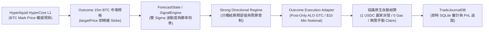
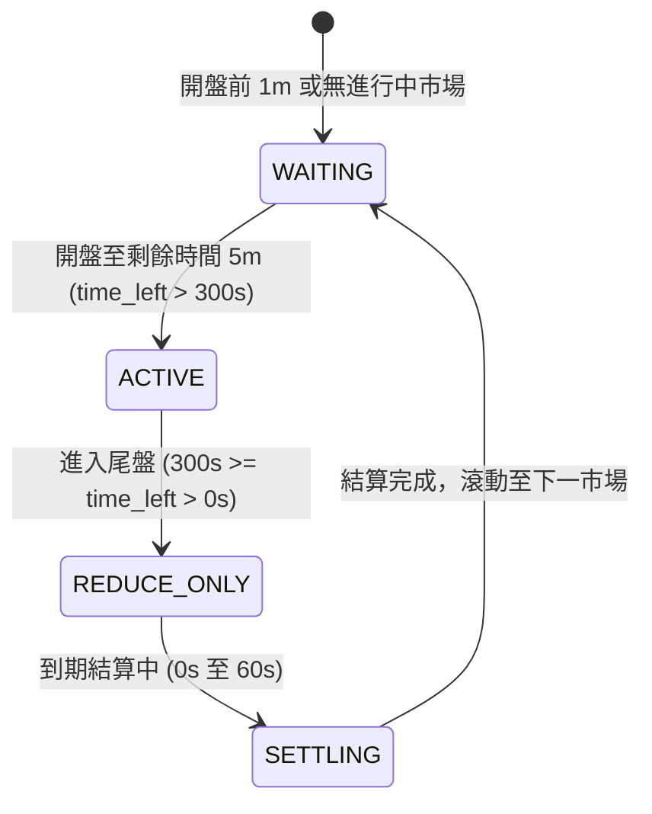
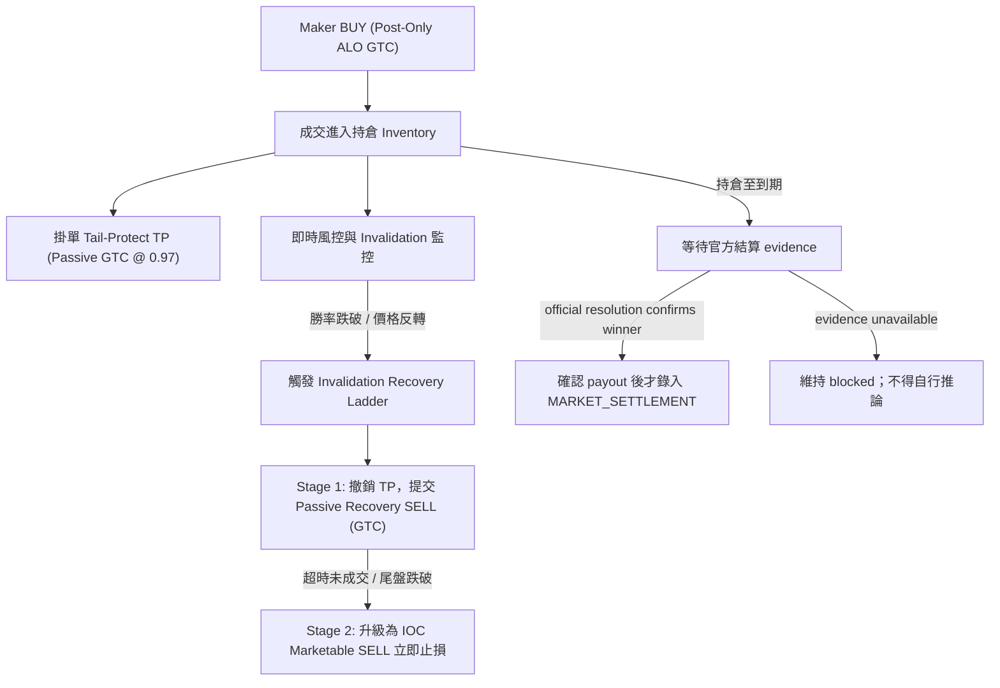

# Hyperliquid Outcome (HIP-4) BTC 15-Minute Prediction Market Trading Bot — Current Authority

> **權威架構版本 (Authority Version)**：2.1.0 (Hyperliquid Outcome HIP-4 Migration Baseline)
> **建立與審計日期**：2026-08-23  
> **目標系統**：Hyperliquid HyperCore L1 原生預測市場 — Outcome (HIP-4 協議標準)  
> **單一權威聲明**：本文件取代原 `project_overview.md`，為系統唯一的設計、架構、量化模型與執行權威規範。

> **遷移保護原則（2026-08-23 補充）**：原 Polymarket 程式中的訊號、波動度、公允價格、進出場、風控、日誌、報表與測試，均是本專案的量化知識資產與回歸基準，必須保留並逐項移植。只有已被 Outcome 等價機制取代、且有對照測試證明不再需要的 *venue adapter 邊界*，才可停止使用；不得以檔名含 Polymarket、Nautilus、Polygon 或 Redeem 作為刪除理由。

> **實盤狀態**：已驗證主網 `outcomeMeta`、`allMids` 與 BTC YES L2 book 可唯讀連線；尚未完成 agent-key 下單、成交/持倉事件與結算的端到端驗證。因此本文件的目標架構不等於已完成實作，live 解鎖前必須依「陸、五階段遷移實施路徑」逐項驗收。

---

## 零、遷移執行追蹤（Migration Execution Tracker）

| 能力 | 可重用的既有知識資產 | Outcome 替換邊界 | 狀態 |
| :--- | :--- | :--- | :--- |
| 市場資料 | ForecastState、SpotPricer、SignalEngine | OutcomeClient、OutcomeLifecycle、OutcomePricingState、Outcome snapshot bridge、OutcomeShadowRunner | **已開始**：將 BTC mark 與 L2 book 映射為既有 MarketSnapshot；唯讀 shadow runtime 已可寫入 journal |
| 下單與撤單 | quote economics、re-quote、單市場限額 | OutcomeExecutionAdapter | mock 測試存在；尚待 SDK/testnet 對照 |
| 成交與持倉 | PositionManager、fill ledger、exit engine | OutcomeFillEvent / OutcomeJournalBridge / OutcomeAccountSynchronizer | **已開始**：`spotClearinghouseState` 的 `+<encoding>` balance、`frontendOpenOrders`、`userFills` 唯讀映射為既有 PositionState 與 journal schema |
| 結算與 hold-to-redeem | TradeJournalDB、regime calibration、PnL attribution | OutcomeSettlementEvent | **已開始**：只接受官方確認的結算事件，禁止用即時 BTC mid 推定 |
| 風控與研究 | entry gate、invalidation ladder、shadow reports | Outcome market key / inventory source | 待上述事件與持倉同步完成後接線 |

已完成的轉譯層包括 `bot/outcome_event_bridge.py`、`bot/outcome_snapshot_bridge.py` 與 `bot/outcome_account_sync.py`。它們刻意不修改既有 Polymarket 策略核心，並以相同的 SQLite `ORDER_FILLED` / `MARKET_SETTLEMENT` schema 餵給既有分析與 calibration。帳戶同步只呼叫 `/info` 的唯讀端點：`spotClearinghouseState`、`frontendOpenOrders`、`userFills`；`entryNtl / total` 僅作為聚合平均成本，`hold` 會從可賣庫存扣除。任何 `dir=settlement` fill 僅留作待驗證證據，不能生成 `MARKET_SETTLEMENT` 或解鎖下一市場。對照測試位於 `tests/test_outcome_event_bridge.py`、`tests/test_outcome_snapshot_bridge.py`、`tests/test_outcome_account_sync.py`。

**本切面驗收結果（2026-08-23）**：fixture 已證明相同帳戶快照能產出既有 `PositionState`、餵入 `PositionManager`，並由既有 `ExitPolicyEngine` 產生 `HOLD_TO_REDEEM`。另已對已配置操作者錢包成功執行一次唯讀同步；三端點均可回覆，當時 Outcome 持倉、未成交單、fills 均為 0，且未簽名或下單。尚未取得實際**非空** Outcome position / open-order 回覆，因此 live execution 仍為鎖定狀態；下一步必須以唯讀錢包查詢保存已脫敏 fixture，並驗證現實欄位與取消/成交生命周期。

### 唯讀 Shadow 收集器（正式資料收集入口）

使用 `scripts/outcome_shadow.py`，而不是 `bot/launcher.py` 的 simulation loop。前者不 import execution adapter，且只會透過 `/info` 讀取 `outcomeMeta`、`allMids`、`l2Book`、`spotClearinghouseState`、`frontendOpenOrders`、`userFills`。每個 cycle 會將 `MarketSnapshot` / `PositionState` 餵入既有 `PositionManager` 和 `ExitPolicyEngine`，把結果記成 `OUTCOME_SHADOW_CYCLE`；不會產生模擬成交、簽名或 `/exchange` 請求。

每筆 `OUTCOME_SHADOW_CYCLE` 同時保留研究與回測所需的資料：YES/NO `best_bid`、`best_ask`、spread、spot-vs-strike、`ForecastState` 的 sigma / 公平機率診斷、`SignalEngine` 的各層分數與權重、`proposed_side`、`entry_eligible`，以及對每側產生的 exit decision。`would_submit_entry=true` 僅代表既有訊號規則認為可進場；`execution_blocked=true` 是不可移除的 shadow 安全旗標，絕不代表已下單。

```bash
# 先跑一個 cycle，確認市場、帳戶與 SQLite 寫入
./.venv/bin/python scripts/outcome_shadow.py --cycles 1

# 長時間收集；Ctrl-C 安全停止
./.venv/bin/python scripts/outcome_shadow.py --interval-sec 5

# P0/P1：保留原始規格、L2 / mid / trades，並對 WS 重連做 REST resync 記錄
./.venv/bin/python scripts/outcome_shadow.py --interval-sec 5 --ws \
  --journal-path logs/outcome_shadow.db
```

P0 實作於 `bot/outcome_spec_audit.py`：首次見到的 raw `outcomeMeta`（含 hash、side names、expiry、target、quote token）會記為 `OUTCOME_MARKET_SPEC_OBSERVED`；到期只能記 `OUTCOME_RESOLUTION_PENDING`，不允許由 BTC mid 或 token 價格推定勝方。`OUTCOME_RESOLUTION_CONFIRMED` 僅接受明確標為 `official_*` 的原始證據。現階段尚未發現官方 machine-readable resolution payload，因此這是明確的 live blocker。

P1 的 `--ws` 實作於 `bot/outcome_ws_recorder.py`，記錄 `OUTCOME_WS_L2_BOOK`、`OUTCOME_WS_ALL_MIDS`、`OUTCOME_WS_TRADES`、server/local timestamp、可用 sequence 與 lifecycle。HIP-4 公開 stream 沒有可依賴的 sequence 欄位時，記錄 `sequence_available=false`，重連本身就是 gap evidence；任何 connect/disconnect 後的下一次 REST market refresh 會寫 `OUTCOME_WS_REST_RESYNC`。可查驗資料是否持續寫入：

```bash
sqlite3 logs/outcome_shadow.db "select event_type, count(*) from strategy_events where event_type like 'OUTCOME_%' group by event_type order by event_type;"
```

在第二個 terminal 可啟動下列唯讀 dashboard，且 `--db` 必須與 collector 的 `--journal-path` 相同：

```bash
./.venv/bin/python scripts/outcome_shadow_dashboard.py --db logs/outcome_shadow.db
```

它從 SQLite 顯示同一筆 cycle 的 BTC mark、strike、YES/NO bid-ask、spread、公平機率、SignalEngine 分數與帳戶同步數量，可直接對照 Outcome 前端。資料會有 collector interval 加上 dashboard refresh interval 的延遲；它不連 API、更不可能下單。

2026-08-23 的主網 smoke test 已成功選到 BTC Outcome `#1145`，並記錄兩個 side 的風控輸入；帳戶持倉、掛單與 fills 當時均為 0。此結果只驗證空帳戶與市場資料流，**不是** live 下單許可。

### 策略方向修正與驗收計劃（2026-08-23）

**結論：不把「預測 BTC 方向」當作預設 edge。** Polymarket 的既有研究已顯示 raw model 沒有穩定打敗 market midpoint；在 HIP-4 上也應把 forecast 視為風險特徵與報價條件，而非單獨的進場理由。低勝率本身不能證明系統慢：買低機率 outcome 的正期望策略可以低於 50% 勝率。應以每股已實現 PnL、校準誤差、fill 後 adverse markout、fill probability 與費後期望值判斷，而不是以勝負筆數判斷。

Outcome/HIP-4 的機制提供四個需驗證的研究方向：

1. **結算規格正確性。** Price market 以 HyperCore mark 在 settlement timestamp 前後更新值做線性插值；到期後 winning token 自動兌付 1 USDC、其餘為 0，open orders 自動取消。每個 recurring instance 都是獨立 market，不能跨期沿用 strike 或 inventory。這延續 Polymarket D.3 的核心價值，但目前 `outcomeMeta` 對 BTC market 只提供 `description`、`sideSpecs`、`quoteToken`，沒有明示比較符號、settlement fee 或最終 resolution payload。因此不得從即時 BTC mid 自行推定結果，也不得把 `targetPrice` 的 `>=`/`>` 假設寫死；必須先取得官方可機器讀取的 resolution / settlement source，逐期核對。
2. **complete-set / conversion parity。** YES + NO 由 split / merge 以 1 USDC 錨定，兩側 book 在協議層合併；買 YES 等同以互補價格賣 NO。研究者必須以「鏡像後的有效 bid/ask 與深度」而非單側 mid 計算可交易價格。觀測 `ask_yes + ask_no`、`bid_yes + bid_no`、深度與所有成本後，才可能發現可 split/merge 鎖定的機制殘差；不得把同一筆合併流動性重複計算。conversion 是簽名且直接改變 spot balances 的交易操作，僅能在獨立測試 gate 後啟用。
3. **被動報價的 adverse selection。** Maker 收益不是 spread 本身，而是「成交後、扣除費用／reward／退出成本的 markout」。現有 D.4 樣本不足時，任何放寬 entry gate 都屬未驗證。P5 exit 應比較可執行 bid 與到期保證 payout（扣 settlement fee），而不是一律 hold 或一律快速出場。
4. **特徵只作條件，不作信號承諾。** Binance/spot 領先性、BTC trend、strike distance 與 order-book imbalance 都要用非重疊 out-of-sample 檢驗；只有在特定時間窗、spread、depth、volatility regime 對「未來 executable mid / fill markout」有顯著而穩定的增益時，才作為 quote width、size、cancel 或 inventory limit 的條件。

#### 分階段改善計劃

| 階段 | 工作 | 產出／驗收門檻 | 下單權限 |
| :--- | :--- | :--- | :--- |
| P0 — 規格真相表 | 每期保存 `outcomeMeta` 原始 spec、side names、expiry、target、quote token；建立官方 resolution 來源與 settlement fee 的人工／API 對照表。 | 至少 20 個已結算 instance；0 個 strike、expiry、winning side、payout 不一致。缺少官方 comparator 或 fee 時即阻擋。 | 禁止 |
| P1 — 資料品質 | 將 5 秒 REST shadow 保留為 health check；新增 WebSocket L2、mid、trade 流與 server timestamp、sequence/gap/reconnect 標記。每次重連後以 REST snapshot resync。 | 市場資料 coverage ≥99%、所有 gap 可標記；兩側 top-of-book 與 Outcome UI 可重現。 | 禁止 |
| P2 — 非方向性回測 | 以每個 snapshot 建立鏡像有效 book、complete-set parity、depth / slippage、spread capture 和 conversion counterfactual；分開計算 maker 與 taker。 | 僅在所有費用、builder fee、settlement fee、slippage 之後仍有正期望，且 out-of-sample 可重複，才保留候選。 | 禁止 |
| P3 — adverse-selection 模型 | 使用真實或明確標為模擬的 passive fill counterfactual，估計 1/5/10/30 秒 markout、fill probability、cancel race 與 recovery fill probability；按 time-left、side、spread、depth、vol regime 分桶。 | 每個可啟用 bucket 至少 30 個獨立 fill 樣本；95% 信賴下界的費後 EV 為正。無樣本 bucket 維持不報價。 | 禁止 |
| P4 — 受限 canary | 只在 P0–P3 通過後，以單一 side、單一 order、硬名義上限、ALO/post-only、即時 order/fill WebSocket、kill switch 做小額實驗。 | 驗證 order acknowledgement、partial fill、cancel race、spot balance、settlement 與 journal 完整一致；任一不一致即停。 | 需人工核准 |

**本輪實作狀態：** P2 已以 `OutcomeParityAnalyzer` 寫入 `OUTCOME_P2_PARITY_SNAPSHOT`，只計算雙側可執行深度的 complete-set counterfactual，明確排除未驗證費用，且 conversion submission disabled。P3 已把真實 Outcome fills 去重寫入既有 `ORDER_FILLED`，並使用未來 executable bid/ask 計算 markout；passive candidates 一律標示 `UNKNOWN_NO_QUEUE_MODEL`，不會被當成成交。P4 的 `OutcomeCanaryGate` 是 hard-disabled 的唯讀稽核器，沒有 exchange client 或簽名程式碼；即使資料門檻滿足仍會 block，必須日後另行人工核准與實作。

**SDK Guides 對齊（2026-08-23）：** repo 是 Python direct-adapter，不能逐字使用官方 TypeScript SDK，但已對齊其關鍵語意：`OutcomeMarketSpec` 保留 typed side names / raw metadata；價格以五位有效數字對齊、size 可傳 market `szDecimals`；原始 order reply 正規化為 `success/status/error`；exchange action 在明確的 agent-approval verification 前一律拒絕；WS 使用單連線、unsubscribe、指數 backoff（最多十次）與 lifecycle resync。仍不可將 `compute_settlement` 用 BTC mark 推定勝方，它現在會直接拒絕。官方參考：[fetch markets](https://docs.outcome.xyz/sdk/guides/fetch-markets.md)、[trading](https://docs.outcome.xyz/sdk/guides/trading.md)、[conversions](https://docs.outcome.xyz/sdk/guides/conversions.md)、[real-time data](https://docs.outcome.xyz/sdk/guides/real-time-data.md)。

#### 必須修正或新增的資料欄位

- 每筆 snapshot：兩側完整 L2 depth、server timestamp、local receive timestamp、book age、WS reconnect / gap、鏡像有效 bid/ask、`YES+NO` 可執行 bundle 價格、預估滑價。
- 每筆候選 quote：fair（僅作條件）、spread capture、maker/taker/settlement/builder fee、預測 fill probability、1/5/10/30 秒 adverse markout、cancel-to-fill race、預估 exit cost。
- 每個 instance：原始 market spec、官方 resolution evidence、winning side、實際 payout 與 settlement fee；不可使用當時 BTC mid 代替。
- 每個帳戶同步：open-order timestamp / remaining size、balance `total`/`hold`/`entryNtl`、fills cursor；`userFills` 有回傳筆數上限，必須本地持久化去重，不能靠事後單次 query 補全。

#### 當前明確禁止事項

1. 因為 `proposed_side` 顯示 UP/DOWN 就下單；它目前只是影子特徵。
2. 以 1d 的結果直接校準未來 15m quote width、sigma 或 exit 時間；兩者必須分 market-period 分桶。
3. 將 Outcome 目前「testing 階段交易費為零」視作永久經濟假設。費率、builder fee 與每 market settlement fee 必須在每次研究／下單時計入。
4. 把 5 秒 polling 當成 maker latency 或 cancel-race 的測量工具；它只能做 health/低頻研究，不能證明速度優勢。

官方依據： [Outcome 與 HIP-4](https://docs.outcome.xyz/outcome-and-hyperliquid.md)、[token parity](https://docs.outcome.xyz/outcome-tokens-and-pricing.md)、[recurring lifecycle](https://docs.outcome.xyz/recurring-markets.md)、[order book](https://docs.outcome.xyz/reading-the-order-book.md)、[order lifecycle](https://docs.outcome.xyz/order-lifecycle.md)、[resolution](https://docs.outcome.xyz/resolution-and-settlement.md)、[fees](https://docs.outcome.xyz/fees.md)、[HIP-4 conversions](https://docs.outcome.xyz/sdk/guides/conversions.md)、[real-time SDK](https://docs.outcome.xyz/sdk/guides/real-time-data.md)、[account adapter](https://docs.outcome.xyz/sdk/reference/account-adapter.md)。

---

## 壹、 系統總覽與架構優勢 (System Overview & Architectural Advantages)

本交易系統專為 **Hyperliquid 原生預測市場平台 —— Outcome (HIP-4 協議)** 所設計，專注於 15 分鐘週期的 BTC 數字預測市場做市與方向性套利。

系統採用非同步低延遲 Python 原生架構，透過 Hyperliquid L1 的 MessagePack + keccak256 + EIP-712 雙層 Agent Key 授權機制進行無感毫秒級下單與撤單。

### 核心技術優勢



1. **L1 原生撮合與極低延遲**：撮合延遲 `< 200ms`，消除中心化 API 尖峰排隊與丟單風險。
2. **免除 Oracle 錯位風險**：`OutcomeMarketSpec` 直接標明 `targetPrice` 為 Strike，結算採用 HyperCore BTC Mark Price 線性插值，徹底告別外部 TWAP 爬蟲。
3. **全網統一保證金 (Unified Margin)**：USDC 在現貨、永續合約與預測市場通用，零 Gas 損耗。
4. **協議原生自動結算**：市場到期自動派發 1 USDC，掛單自動取消，完全無需外部合約 Redeem / Claim 腳本。
5. **安全暫態 Agent Key**：主錢包（EOA）簽名一次授權，Agent Key 記憶體中運行，零私鑰洩漏風險。

---

## 貳、 端到端交易生命週期 (End-to-End Trading Lifecycle)

### 1. 生命週期狀態機 (Market Lifecycle State Machine)



| 階段 | 狀態代碼 | 行為與管制規則 | 觸發條件 |
| :--- | :--- | :--- | :--- |
| **等待發現** | `WAITING` | 監聽 `outcomeMeta`，自動解析即將開盤的 15m BTC 市場與 Strike。 | 距離開盤 $> 0\text{s}$ 或無活躍市場 |
| **做市活躍** | `ACTIVE` | 計算 `ForecastState`、`side_score`，提交 Maker Post-Only (ALO) BUY 掛單。 | 開盤至剩餘時間 $> 300\text{s}$ |
| **僅允許減倉** | `REDUCE_ONLY` | 嚴格禁止新開倉 BUY，僅保留 TP 或觸發 Invalidation 止損階梯。 | 剩餘時間 $\le 300\text{s}$ |
| **協議結算** | `SETTLING` | 撤銷所有殘留掛單，監聽 L1 USDC 派發並記錄 `MARKET_SETTLEMENT`。 | 剩餘時間 $\le 0\text{s}$ |

### 2. BTC 預測市場規範解析 (Market Spec Parsing)

Outcome 支援多週期 BTC 預測市場規格格式：
- **15 分鐘合約**：`class:priceBinary|underlying:BTC|expiry:YYYYMMDD-HHMM|targetPrice:78213.5|period:15m`
- **日線合約 (Daily)**：`class:priceBinary|underlying:BTC|expiry:YYYYMMDD-HHMM|targetPrice:77431|period:1d`
- **Outcome ID**：例如 `1145` (Daily) 或 `516` (15m)
- **Side 0 (`#11450`)** 與 **Side 1 (`#11451`)**：目前只可安全視為 `outcomeMeta.sideSpecs` 所列的兩個 token；不得把它們寫死為 UP/DOWN，或假定比較符號是 `$\ge$` / `$<$`。
- **結算比較符號、winning side、payout 與 settlement fee**：必須來自每期保存的官方 resolution evidence；在 P0 完成前不能由 `targetPrice`、BTC mid 或 token price 推論。
- **Wire Asset ID**：
  $$\text{Asset ID} = 100\,000\,000 + (\text{outcomeId} \times 10) + \text{sideIndex}$$

---

## 參、 核心量化模型與決策引擎 (Quantitative Brain)

### 1. 統一波動度與公允定價模型 (`ForecastState` & `SpotPricer`)
- **輸入**：HyperCore BTC Mark Price、合約 Strike (`targetPrice`)、剩餘時間 $\tau$、盤口微觀 mid。
- **波動度估計**：
  - 歷史滾動收益率標準差 $\sigma_{\text{hist}}$
  - 時間衰減修正：$\sigma_{\text{decay}} = \sigma \cdot \sqrt{\tau / \tau_{\text{ref}}}$
  - 隱含波動度下限保護 (Implied Volatility Floor)
- **公允勝率**：
  $$d_2 = \frac{\ln(S / K) - \frac{1}{2}\sigma^2 \tau}{\sigma \sqrt{\tau}}, \quad P(\text{UP}) = \Phi(d_2)$$

### 2. 方向性決策評分與分桶勝率校準 (`SignalEngine` & `StrongDirectionalRegime`)
- **`side_score` 計算**：結合價格偏離 Strike 之點數、盤口深度不平衡、動量因子與勝率預測。
  - `side_score > +0.20` $\rightarrow$ 判定方向為 **UP**
  - `side_score < -0.20` $\rightarrow$ 判定方向為 **DOWN**
  - 否則為 **NONE**（放棄開倉，嚴禁摸魚無效交易）。
- **進場窗口與預算管制**：
  - 開盤前 10–30 秒與 30–60 秒分桶結算期望值（Resolution EV）校準。
  - **單一市場一次性進場保證**：首筆成交即鎖定該市場預算，嚴格禁止追價加倉（Hard limited to 1 BUY per market cycle）。

### 3. 下單規模與 10 USDC 最小名義價值校準 (`QuoteEconomics`)
- **Min Notional 限制**：Hyperliquid 協議要求開倉名義價值 $\text{price} \times \text{shares} \ge 10\text{ USDC}$。
- **動態股數計算**：
  $$\text{shares} = \max\left(\text{target\_shares}, \left\lceil \frac{10.0}{\text{price}} \right\rceil\right)$$
- **費率模型**：
  - 交易、builder 與 settlement fee 必須以每期官方 evidence 讀取／記錄；testing 階段的零交易費不可視為永久假設。
  - 在 P0 尚無可驗證 settlement fee 前，任何 `robust_net` 都只能作研究指標，不得作 live entry gate。

---

## 肆、 執行與止損階梯架構 (`OutcomeExecutionAdapter`)



1. **Maker BUY 下單**：
   - 提交 GTC Post-Only (`tif="Alo"`)，確保 100% 享受 Maker 費率且不穿越盤口。
   - 報價重掛機制（Requote Hysteresis）：若價格變動小於門檻跳數，維持原單佇列優先權（Queue Priority）。
2. **獲利止盈 (Take-Profit)**：
   - 預設掛於 `0.97` GTC 限價賣單，直至到期或觸發出場。
3. **失效止損階梯 (Invalidation Recovery Ladder)**：
   - **階段一（被動掛單）**：即時撤銷 TP，提交 `RECOVERY_EXIT_PASSIVE_TTL_SEC` 之 GTC 被動限價賣單。
   - **階段二（主動市價）**：若超時或在尾盤急跌，立即發送 `IOC` (Immediate-Or-Cancel) 賣單全數離場。

---

## 伍、 模組目錄架構與檔案權責 (Codebase Directory Map)

```text
/Users/cheng-kaihuang/Hyperliquid_prediction_bot/
├── bot/
│   ├── adapters/
│   │   ├── outcome_auth.py        # Agent Key 生成、MessagePack、EIP-712 簽名與 Asset ID 計算
│   │   └── outcome_client.py      # 原生 Python 非同步/同步 REST (/info, /exchange) 與 WebSocket 串流
│   ├── lifecycle/
│   │   ├── outcome_lifecycle.py   # class:priceBinary 規格解析、15m 市場發現與狀態流轉
│   │   └── legacy.py              # 兼容輔助函式
│   ├── pricing/
│   │   └── outcome_pricing.py     # HyperCore BTC Mark Price、L2 盤口追蹤與 10 USDC 經濟學門檻
│   ├── execution/
│   │   └── outcome_execution.py   # Maker BUY (ALO)、TP 掛單、IOC 止損階梯與到期結算核算
│   ├── outcome_event_bridge.py    # HIP-4 fills / settlement 證據至既有 journal schema
│   ├── outcome_snapshot_bridge.py # Outcome market book 至既有 MarketSnapshot / PositionState
│   ├── outcome_account_sync.py    # 唯讀帳戶同步：balances、open orders、fills
│   ├── outcome_shadow_runner.py   # 唯讀 market/account → PositionManager / ExitEngine / journal
│   ├── signal_engine.py           # 核心機率偏離評估與 side_score 計算
│   ├── forecast_state.py          # Sigma 波動度、時間衰減與 Delta 計算
│   ├── strong_directional_regime.py # 勝率校準分桶與 Resolution EV 機制
│   ├── position_manager.py        # 單市場 1 筆預算管制與倉位鎖定
│   ├── app_config.py              # 統一組態配置 (含 HyperliquidConfig)
│   ├── launcher.py                # 啟動器、預檢 (Preflight) 與多環境管理
│   └── enums.py                   # MarketPhase, ActiveSide 等枚舉
├── monitoring/
│   ├── trade_journal_db.py        # SQLite 本地交易日誌與事件審計
│   └── pnl_attribution.py         # PnL 多維度歸因分析
├── execution/
│   ├── maker_engine.py            # 做市報價計劃生成
│   └── rebate_model.py            # 費率與 QuoteEconomics 結構
├── config/
│   ├── operator.env.example       # 支援的維運人員設定檔範本
│   └── profiles/
│       └── btc15_twap_v3.env      # 基準策略參數配置
├── tests/                         # 310+ 完整單元與回歸測試套件
├── scripts/outcome_shadow.py      # 正式唯讀 shadow 資料收集命令
├── scripts/outcome_shadow_dashboard.py # 唯讀 SQLite telemetry dashboard
├── .env.example                   # 本地環境變數範例 (含 HL_* 密鑰)
├── README.md                      # 英文官方操作文檔
├── docs/
│   └── readme_ZH.md               # 繁體中文官方操作文檔
└── run_bot.py                     # 主策略執行入口
```

---

## 陸、 環境變數與維運配置指引 (Environment & Operator Configuration)

### 關鍵環境變數清單

| 變數名稱 | 預設值 / 格式 | 說明 |
| :--- | :--- | :--- |
| `VENUE` | `hyperliquid` | 目標預測市場（`hyperliquid` 或 `polymarket`） |
| `HL_WALLET_ADDRESS` | `0x...` | 主帳戶錢包地址 (EOA) |
| `HL_PRIVATE_KEY` | `0x...` (64 hex) | 主帳戶私鑰 (用於一次性簽名授權 Agent Key) |
| `HL_AGENT_PRIVATE_KEY` | `0x...` (選填) | 專用 Agent Key 私鑰 (若留空則程式自動生成暫態 Key) |
| `HL_TESTNET` | `0` (主網) / `1` (測試網) | 是否連線至 Hyperliquid Testnet |
| `HL_MIN_NOTIONAL_USDC` | `10.0` | 最小開倉名義價值 (USDC) |
| `HL_REFERRAL_CODE` | `""` | 推薦碼 (享受 4% 手續費返還折扣) |
| `ENTRY_SCORE_MIN` | `0.20` | 強方向性進場最低分數門檻 |
| `FIRST_ENTRY_SCORE_MIN` | `0.22` | 首筆進場嚴格分數門檻 |
| `FIRST_ENTRY_MAX_TIME_LEFT_SEC` | `720` | 開盤後允許首筆進場的最大剩餘時間 (秒) |
| `HOLD_TO_REDEEM` | `1` | 獲利時鎖定至到期結算 (1 USDC 派發) |
| `RECOVERY_EXIT_ENABLED` | `1` | 啟用 Invalidation 階梯止損 |

---

## 柒、 快速啟動與日常維運命令 (Operational Runbook)

### 1. 執行安全性預檢 (Preflight Check)
```bash
.venv/bin/python bot/launcher.py --preflight-only
```

### 2. 啟動模擬回測 / 影子交易 (Dry-run Simulation)
```bash
.venv/bin/python bot/launcher.py --venue hyperliquid
```

### 3. 啟動實盤交易 (Live Trading)
```bash
.venv/bin/python bot/launcher.py --venue hyperliquid --live
```

### 4. 運行完整回歸測試套件 (Automated Test Suite)
```bash
.venv/bin/pytest
```

---

> **架構維護承諾**：本專案嚴格維持單一權威文件原則。所有量化邏輯調整、費率變更或執行策略更新，必須同步修訂本文件與對應單元測試。
